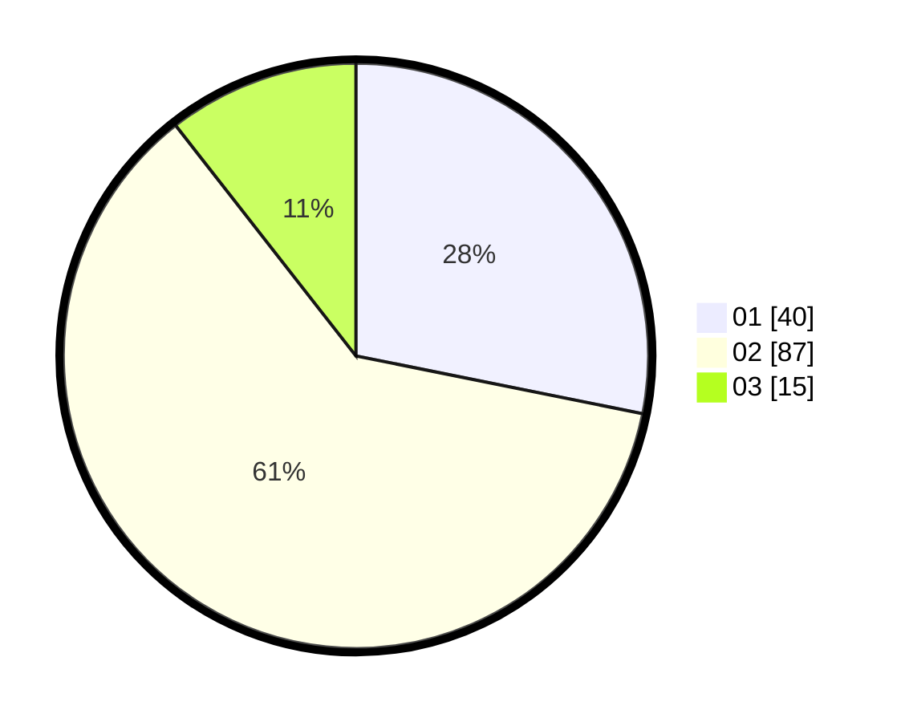

# Hasil

Hasil perolehan suara paslon dapat dilihat pada file paslon-01.txt, paslon-02.txt, dan paslon-03.txt.

Jika tidak ada, artinya data tersebut belum ada pada SIREKAP.

## Perolehan Suara

 * Paslon 01: **40**.
 * Paslon 02: **87**.
 * Paslon 03: **15**.

## Foto C Plano

https://sirekap-obj-formc.kpu.go.id/7f23/pemilu/ppwp/31/73/01/10/05/3173011005246-20240215-112851--bc808f6f-665d-405e-af40-190a7439fded.jpg

https://sirekap-obj-formc.kpu.go.id/7f23/pemilu/ppwp/31/73/01/10/05/3173011005246-20240215-112939--deabd056-6cb5-4bff-9f3b-917e8543ab15.jpg

https://sirekap-obj-formc.kpu.go.id/7f23/pemilu/ppwp/31/73/01/10/05/3173011005246-20240215-113342--fee2b142-4c99-43f6-92e4-af7afbcf9af5.jpg
