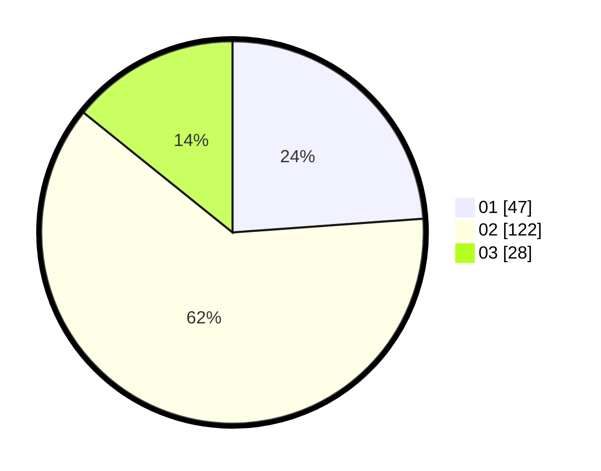

# Hasil

Hasil perolehan suara paslon dapat dilihat pada file paslon-01.txt, paslon-02.txt, dan paslon-03.txt.

Jika tidak ada, artinya data tersebut belum ada pada SIREKAP.

## Perolehan Suara

 * Paslon 01: **47**.
 * Paslon 02: **122**.
 * Paslon 03: **28**.

## Foto C Plano

https://sirekap-obj-formc.kpu.go.id/9762/pemilu/ppwp/31/73/01/10/05/3173011005247-20240214-223841--01a1226f-ad4c-4063-8031-9d0148339ddb.jpg

https://sirekap-obj-formc.kpu.go.id/9762/pemilu/ppwp/31/73/01/10/05/3173011005247-20240214-223942--11ab7a8c-45cd-4671-b511-69100f90d4a0.jpg

https://sirekap-obj-formc.kpu.go.id/9762/pemilu/ppwp/31/73/01/10/05/3173011005247-20240214-224052--3d079627-b8c2-42e6-9fe7-782c964b00ed.jpg
