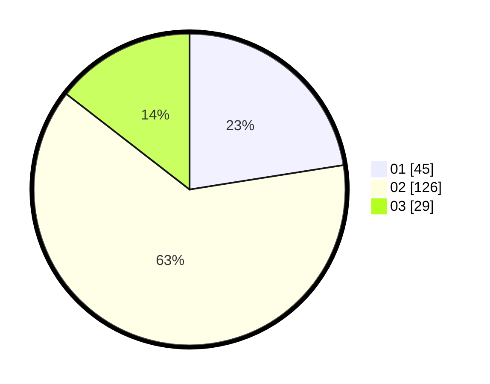

# Hasil

Hasil perolehan suara paslon dapat dilihat pada file paslon-01.txt, paslon-02.txt, dan paslon-03.txt.

Jika tidak ada, artinya data tersebut belum ada pada SIREKAP.

## Perolehan Suara

 * Paslon 01: **45**.
 * Paslon 02: **126**.
 * Paslon 03: **29**.

## Foto C Plano

https://sirekap-obj-formc.kpu.go.id/253e/pemilu/ppwp/31/73/01/10/05/3173011005248-20240214-160146--fc8117c0-ff97-46e5-aa00-6e7c828a1912.jpg

https://sirekap-obj-formc.kpu.go.id/253e/pemilu/ppwp/31/73/01/10/05/3173011005248-20240214-204701--04c430a7-353f-49f9-baa6-23f5da0b4f89.jpg
