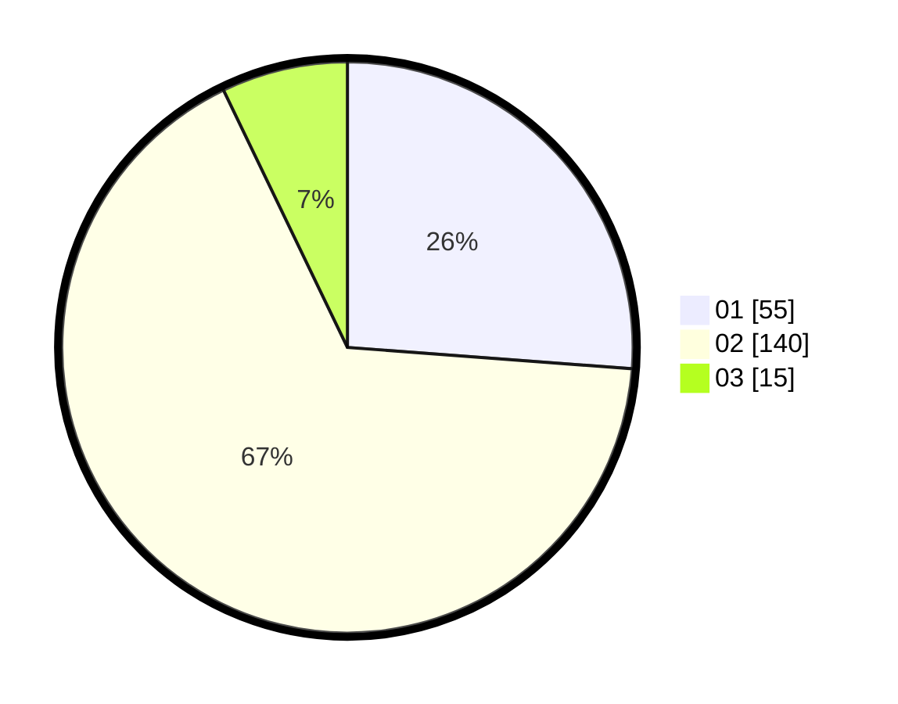

# Hasil

Hasil perolehan suara paslon dapat dilihat pada file paslon-01.txt, paslon-02.txt, dan paslon-03.txt.

Jika tidak ada, artinya data tersebut belum ada pada SIREKAP.

## Perolehan Suara

 * Paslon 01: **55**.
 * Paslon 02: **140**.
 * Paslon 03: **15**.

## Foto C Plano

https://sirekap-obj-formc.kpu.go.id/f17b/pemilu/ppwp/31/73/01/10/05/3173011005254-20240214-234932--9d0811d8-2928-4fc5-863d-364ec9ca61dc.jpg

https://sirekap-obj-formc.kpu.go.id/f17b/pemilu/ppwp/31/73/01/10/05/3173011005254-20240214-235110--de8dbb16-4d9d-4618-ad1e-fb9a39727287.jpg

https://sirekap-obj-formc.kpu.go.id/f17b/pemilu/ppwp/31/73/01/10/05/3173011005254-20240214-235210--88efc50a-eee1-47d1-b6a0-2c96f9f455c4.jpg
