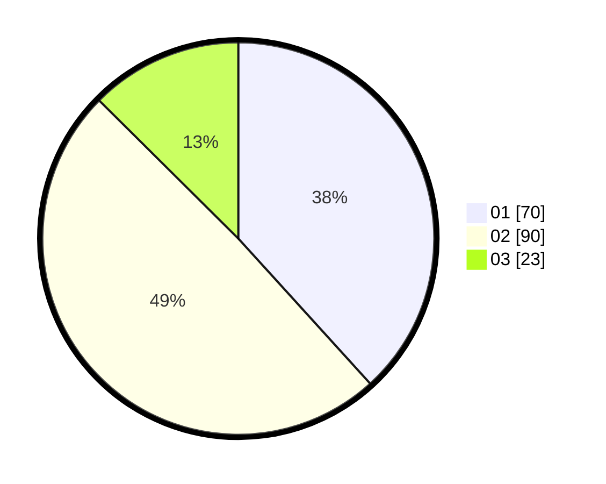

# Hasil

Hasil perolehan suara paslon dapat dilihat pada file paslon-01.txt, paslon-02.txt, dan paslon-03.txt.

Jika tidak ada, artinya data tersebut belum ada pada SIREKAP.

## Perolehan Suara

 * Paslon 01: **70**.
 * Paslon 02: **90**.
 * Paslon 03: **23**.

## Foto C Plano

https://sirekap-obj-formc.kpu.go.id/6ee7/pemilu/ppwp/31/73/01/10/05/3173011005257-20240214-230721--712810ea-71c5-4688-ac5d-b45e0a6ea1ce.jpg

https://sirekap-obj-formc.kpu.go.id/6ee7/pemilu/ppwp/31/73/01/10/05/3173011005257-20240214-230822--7c57730b-9b67-4b0b-821d-35b83f1027c0.jpg

https://sirekap-obj-formc.kpu.go.id/6ee7/pemilu/ppwp/31/73/01/10/05/3173011005257-20240214-230914--95ce607b-0b44-4702-a401-5ed27a7fdb0d.jpg

## DATA PEMILIH TETAP

Jumlah pemilih dalam DPT: **187**.
 * L: **102**.
 * P: **85**.

## DATA PENGGUNA HAK PILIH

Jumlah pengguna hak pilih dalam DPT: **187**.
 * L: **102**.
 * P: **85**.

Jumlah pengguna hak pilih dalam DPTb: **0**.
 * L: **0**.
 * P: **0**.

Jumlah pengguna hak pilih dalam DPK: **0**.
 * L: **0**.
 * P: **0**.

Jumlah pengguna hak pilih: **187**.
 * L: **102**.
 * P: **85**.

## JUMLAH SUARA SAH DAN TIDAK SAH

JUMLAH SELURUH SUARA SAH: **183**.

JUMLAH SUARA TIDAK SAH: **4**.

JUMLAH SELURUH SUARA SAH DAN SUARA TIDAK SAH: **187**.
