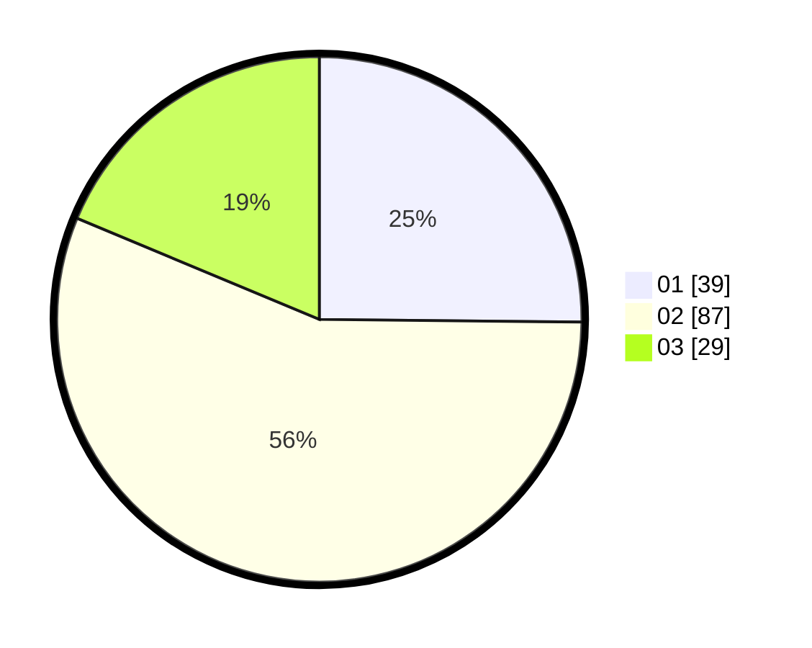

# Hasil

Hasil perolehan suara paslon dapat dilihat pada file paslon-01.txt, paslon-02.txt, dan paslon-03.txt.

Jika tidak ada, artinya data tersebut belum ada pada SIREKAP.

## Perolehan Suara

 * Paslon 01: **39**.
 * Paslon 02: **87**.
 * Paslon 03: **29**.

## Foto C Plano

https://sirekap-obj-formc.kpu.go.id/6a3a/pemilu/ppwp/31/73/01/10/05/3173011005259-20240214-225940--16b8e552-9ad4-4a92-932d-bae421d18f4b.jpg

https://sirekap-obj-formc.kpu.go.id/6a3a/pemilu/ppwp/31/73/01/10/05/3173011005259-20240214-230054--dd4b3542-a601-426c-ab58-d303733f9d35.jpg

https://sirekap-obj-formc.kpu.go.id/6a3a/pemilu/ppwp/31/73/01/10/05/3173011005259-20240214-230130--ed83703b-a8ed-41e5-b284-591a127d5a3f.jpg
