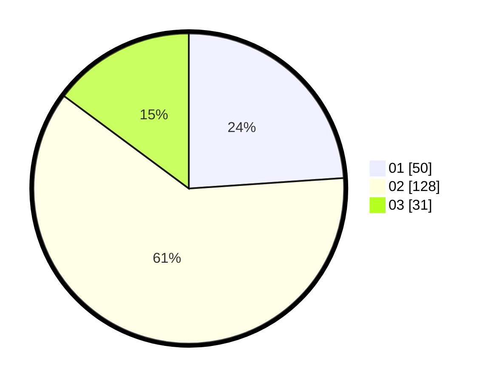

# Hasil

Hasil perolehan suara paslon dapat dilihat pada file paslon-01.txt, paslon-02.txt, dan paslon-03.txt.

Jika tidak ada, artinya data tersebut belum ada pada SIREKAP.

## Perolehan Suara

 * Paslon 01: **50**.
 * Paslon 02: **128**.
 * Paslon 03: **31**.

## Foto C Plano

https://sirekap-obj-formc.kpu.go.id/c47f/pemilu/ppwp/31/73/01/10/05/3173011005262-20240214-221501--6bb5969f-3589-4a15-9936-2b638452cf14.jpg

https://sirekap-obj-formc.kpu.go.id/c47f/pemilu/ppwp/31/73/01/10/05/3173011005262-20240214-222037--7ae61a3e-7b76-4cb2-a913-276cdd54ee13.jpg

https://sirekap-obj-formc.kpu.go.id/c47f/pemilu/ppwp/31/73/01/10/05/3173011005262-20240214-222227--fbb9aa0f-ae2c-4360-ac08-adea76b086ec.jpg
