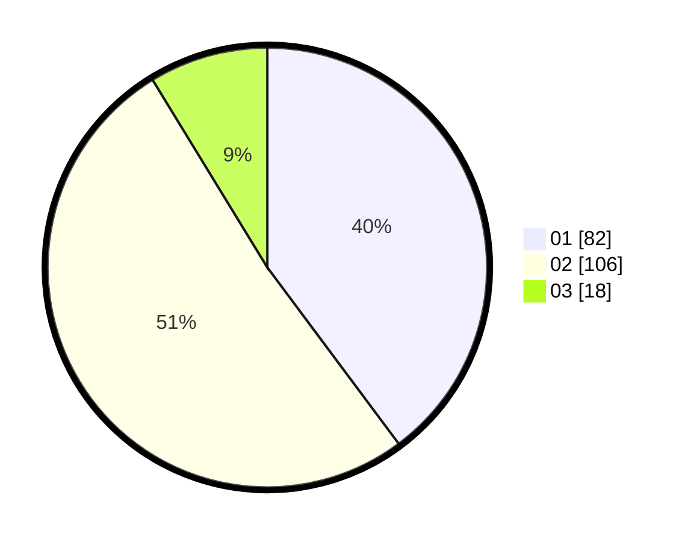

# Hasil

Hasil perolehan suara paslon dapat dilihat pada file paslon-01.txt, paslon-02.txt, dan paslon-03.txt.

Jika tidak ada, artinya data tersebut belum ada pada SIREKAP.

## Perolehan Suara

 * Paslon 01: **82**.
 * Paslon 02: **106**.
 * Paslon 03: **18**.

## Foto C Plano

https://sirekap-obj-formc.kpu.go.id/2e79/pemilu/ppwp/31/73/01/10/05/3173011005267-20240214-224236--6717ab86-65cd-475f-8ff2-594551e9891a.jpg

https://sirekap-obj-formc.kpu.go.id/2e79/pemilu/ppwp/31/73/01/10/05/3173011005267-20240214-224702--704862dd-9b8e-48a6-bbe3-d457e5712ed0.jpg

https://sirekap-obj-formc.kpu.go.id/2e79/pemilu/ppwp/31/73/01/10/05/3173011005267-20240214-224824--6a998e60-1e8f-4f47-9473-627f89ea6dfd.jpg
