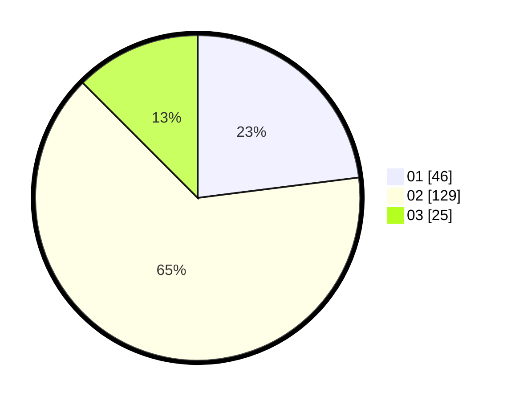

# Hasil

Hasil perolehan suara paslon dapat dilihat pada file paslon-01.txt, paslon-02.txt, dan paslon-03.txt.

Jika tidak ada, artinya data tersebut belum ada pada SIREKAP.

## Perolehan Suara

 * Paslon 01: **46**.
 * Paslon 02: **129**.
 * Paslon 03: **25**.

## Foto C Plano

https://sirekap-obj-formc.kpu.go.id/2304/pemilu/ppwp/31/73/01/10/05/3173011005271-20240214-220251--4c756605-072b-499f-b5ef-bd8bef0f17bc.jpg

https://sirekap-obj-formc.kpu.go.id/2304/pemilu/ppwp/31/73/01/10/05/3173011005271-20240214-220440--18e3b01f-1c06-411e-8c02-66300b84b066.jpg

https://sirekap-obj-formc.kpu.go.id/2304/pemilu/ppwp/31/73/01/10/05/3173011005271-20240214-220602--09f1b452-ad85-4ab1-b367-261365b258c0.jpg
