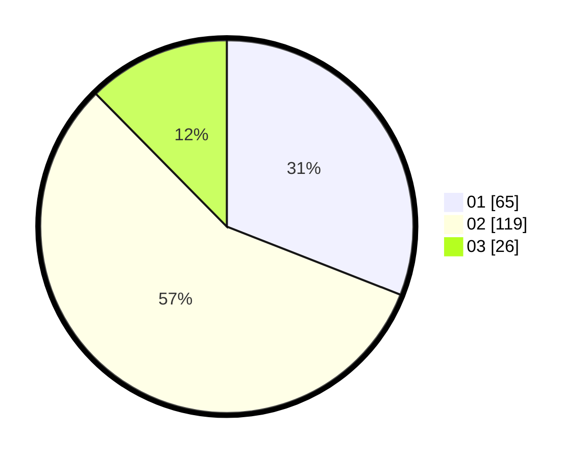

# Hasil

Hasil perolehan suara paslon dapat dilihat pada file paslon-01.txt, paslon-02.txt, dan paslon-03.txt.

Jika tidak ada, artinya data tersebut belum ada pada SIREKAP.

## Perolehan Suara

 * Paslon 01: **65**.
 * Paslon 02: **119**.
 * Paslon 03: **26**.

## Foto C Plano

https://sirekap-obj-formc.kpu.go.id/2b9b/pemilu/ppwp/31/73/01/10/05/3173011005275-20240214-155441--54d15e83-5145-498e-b695-a7083bef9684.jpg

https://sirekap-obj-formc.kpu.go.id/2b9b/pemilu/ppwp/31/73/01/10/05/3173011005275-20240214-155648--19e519fb-53f2-42cb-aaa6-8ce73399dd30.jpg

https://sirekap-obj-formc.kpu.go.id/2b9b/pemilu/ppwp/31/73/01/10/05/3173011005275-20240214-155807--4b166a0c-21fd-4efb-b390-9de27f1ea25d.jpg

## DATA PEMILIH TETAP

Jumlah pemilih dalam DPT: **282**.
 * L: **135**.
 * P: **147**.

## DATA PENGGUNA HAK PILIH

Jumlah pengguna hak pilih dalam DPT: **212**.
 * L: **101**.
 * P: **111**.

Jumlah pengguna hak pilih dalam DPTb: **0**.
 * L: **0**.
 * P: **0**.

Jumlah pengguna hak pilih dalam DPK: **1**.
 * L: **1**.
 * P: **0**.

Jumlah pengguna hak pilih: **213**.
 * L: **102**.
 * P: **111**.

## JUMLAH SUARA SAH DAN TIDAK SAH

JUMLAH SELURUH SUARA SAH: **210**.

JUMLAH SUARA TIDAK SAH: **3**.

JUMLAH SELURUH SUARA SAH DAN SUARA TIDAK SAH: **213**.
