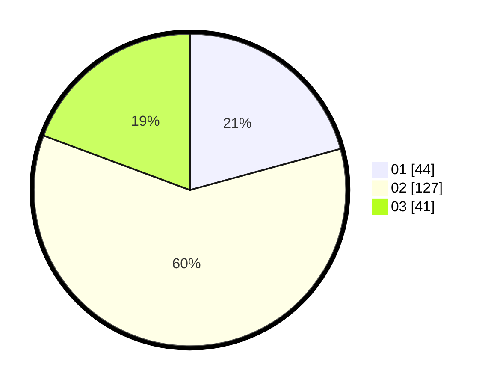

# Hasil

Hasil perolehan suara paslon dapat dilihat pada file paslon-01.txt, paslon-02.txt, dan paslon-03.txt.

Jika tidak ada, artinya data tersebut belum ada pada SIREKAP.

## Perolehan Suara

 * Paslon 01: **44**.
 * Paslon 02: **127**.
 * Paslon 03: **41**.

## Foto C Plano

https://sirekap-obj-formc.kpu.go.id/2915/pemilu/ppwp/31/73/01/10/05/3173011005285-20240214-192922--82761945-bdd5-4724-b1aa-bd82297aacf7.jpg

https://sirekap-obj-formc.kpu.go.id/2915/pemilu/ppwp/31/73/01/10/05/3173011005285-20240214-193103--b4a2de72-03c7-4eec-b6fc-1937e2e2e591.jpg

https://sirekap-obj-formc.kpu.go.id/2915/pemilu/ppwp/31/73/01/10/05/3173011005285-20240214-195933--99cf0e30-faa2-46f2-bbba-832d91228da9.jpg

## DATA PEMILIH TETAP

Jumlah pemilih dalam DPT: **272**.
 * L: **141**.
 * P: **131**.

## DATA PENGGUNA HAK PILIH

Jumlah pengguna hak pilih dalam DPT: **215**.
 * L: **106**.
 * P: **109**.

Jumlah pengguna hak pilih dalam DPTb: **0**.
 * L: **0**.
 * P: **0**.

Jumlah pengguna hak pilih dalam DPK: **1**.
 * L: **1**.
 * P: **0**.

Jumlah pengguna hak pilih: **216**.
 * L: **107**.
 * P: **109**.

## JUMLAH SUARA SAH DAN TIDAK SAH

JUMLAH SELURUH SUARA SAH: **212**.

JUMLAH SUARA TIDAK SAH: **4**.

JUMLAH SELURUH SUARA SAH DAN SUARA TIDAK SAH: **216**.
