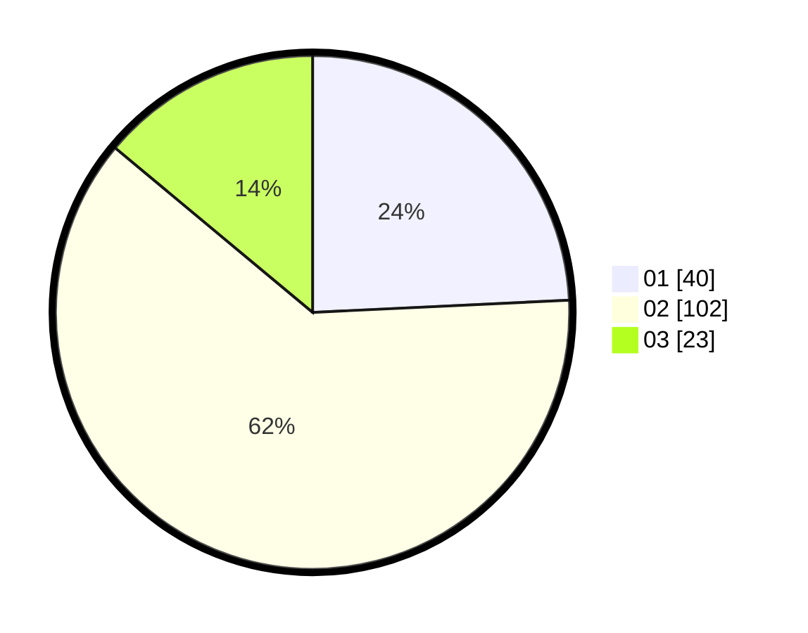

# Hasil

Hasil perolehan suara paslon dapat dilihat pada file paslon-01.txt, paslon-02.txt, dan paslon-03.txt.

Jika tidak ada, artinya data tersebut belum ada pada SIREKAP.

## Perolehan Suara

 * Paslon 01: **40**.
 * Paslon 02: **102**.
 * Paslon 03: **23**.

## Foto C Plano

https://sirekap-obj-formc.kpu.go.id/b644/pemilu/ppwp/31/73/01/10/05/3173011005286-20240214-195525--7e3e0b8a-91ee-417d-94fb-5ac17308fd6e.jpg

https://sirekap-obj-formc.kpu.go.id/b644/pemilu/ppwp/31/73/01/10/05/3173011005286-20240214-195603--479cdf3b-206f-41ca-a5fc-c3f3069acce9.jpg

https://sirekap-obj-formc.kpu.go.id/b644/pemilu/ppwp/31/73/01/10/05/3173011005286-20240215-013807--fe63e4a5-b96d-4d13-90e3-f9931f0fb8da.jpg
