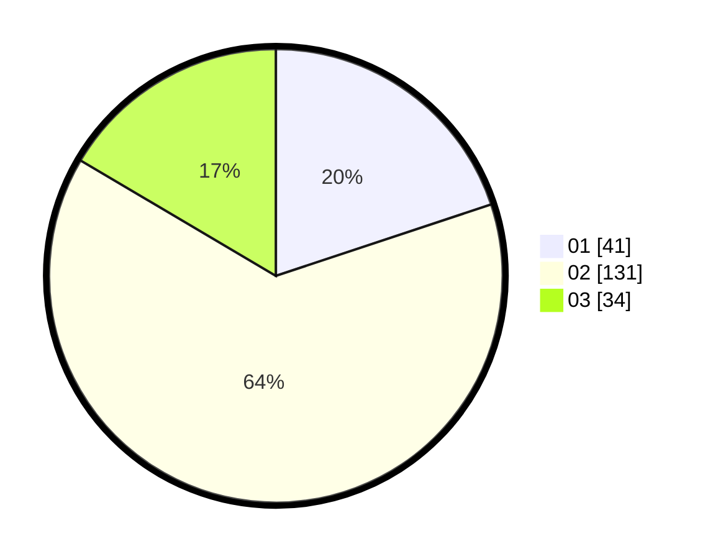

# Hasil

Hasil perolehan suara paslon dapat dilihat pada file paslon-01.txt, paslon-02.txt, dan paslon-03.txt.

Jika tidak ada, artinya data tersebut belum ada pada SIREKAP.

## Perolehan Suara

 * Paslon 01: **41**.
 * Paslon 02: **131**.
 * Paslon 03: **34**.

## Foto C Plano

https://sirekap-obj-formc.kpu.go.id/89de/pemilu/ppwp/31/73/01/10/05/3173011005289-20240214-234145--aee5688b-b0a3-43d6-989b-07ecafd9b304.jpg

https://sirekap-obj-formc.kpu.go.id/89de/pemilu/ppwp/31/73/01/10/05/3173011005289-20240215-004935--19f40a88-2011-41fd-a028-330c2ed74c68.jpg

https://sirekap-obj-formc.kpu.go.id/89de/pemilu/ppwp/31/73/01/10/05/3173011005289-20240216-201735--287fa2a1-5f3c-4463-8895-cdb1e65ff20e.jpg
