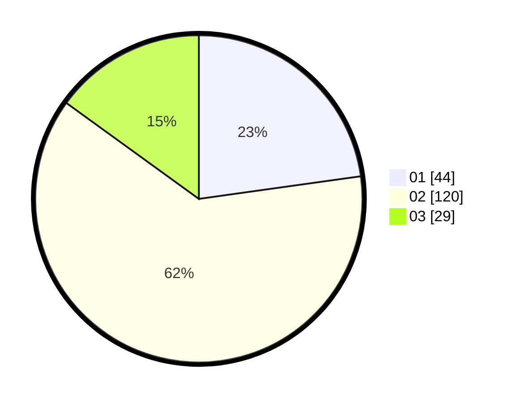

# Hasil

Hasil perolehan suara paslon dapat dilihat pada file paslon-01.txt, paslon-02.txt, dan paslon-03.txt.

Jika tidak ada, artinya data tersebut belum ada pada SIREKAP.

## Perolehan Suara

 * Paslon 01: **44**.
 * Paslon 02: **120**.
 * Paslon 03: **29**.

## Foto C Plano

https://sirekap-obj-formc.kpu.go.id/0350/pemilu/ppwp/31/73/01/10/05/3173011005294-20240215-041833--3bb313a6-e383-4ec1-aa21-3e9338173dd2.jpg

https://sirekap-obj-formc.kpu.go.id/0350/pemilu/ppwp/31/73/01/10/05/3173011005294-20240215-041857--32faebdd-ae7e-4591-81b0-3605d8028491.jpg

https://sirekap-obj-formc.kpu.go.id/0350/pemilu/ppwp/31/73/01/10/05/3173011005294-20240215-041844--733562cb-c816-416d-96d7-88232b2b9de5.jpg

## DATA PEMILIH TETAP

Jumlah pemilih dalam DPT: **258**.
 * L: **131**.
 * P: **127**.

## DATA PENGGUNA HAK PILIH

Jumlah pengguna hak pilih dalam DPT: **196**.
 * L: **91**.
 * P: **105**.

Jumlah pengguna hak pilih dalam DPTb: **0**.
 * L: **0**.
 * P: **0**.

Jumlah pengguna hak pilih dalam DPK: **0**.
 * L: **0**.
 * P: **0**.

Jumlah pengguna hak pilih: **196**.
 * L: **91**.
 * P: **105**.

## JUMLAH SUARA SAH DAN TIDAK SAH

JUMLAH SELURUH SUARA SAH: **193**.

JUMLAH SUARA TIDAK SAH: **3**.

JUMLAH SELURUH SUARA SAH DAN SUARA TIDAK SAH: **196**.
