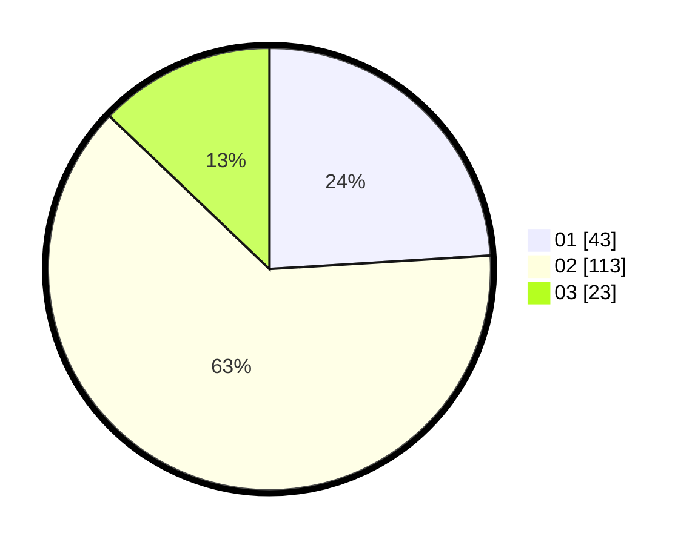

# Hasil

Hasil perolehan suara paslon dapat dilihat pada file paslon-01.txt, paslon-02.txt, dan paslon-03.txt.

Jika tidak ada, artinya data tersebut belum ada pada SIREKAP.

## Perolehan Suara

 * Paslon 01: **43**.
 * Paslon 02: **113**.
 * Paslon 03: **23**.

## Foto C Plano

https://sirekap-obj-formc.kpu.go.id/6a02/pemilu/ppwp/31/73/01/10/05/3173011005308-20240214-211637--dd475a77-f03a-4d1c-a455-f9d705a93dee.jpg

https://sirekap-obj-formc.kpu.go.id/6a02/pemilu/ppwp/31/73/01/10/05/3173011005308-20240214-211823--c051fac7-5abe-4035-b1f9-a26b7535cde6.jpg

https://sirekap-obj-formc.kpu.go.id/6a02/pemilu/ppwp/31/73/01/10/05/3173011005308-20240216-121833--baedf368-2bee-4795-aef2-66d219cadc74.jpg

## DATA PEMILIH TETAP

Jumlah pemilih dalam DPT: **272**.
 * L: **136**.
 * P: **136**.

## DATA PENGGUNA HAK PILIH

Jumlah pengguna hak pilih dalam DPT: **183**.
 * L: **89**.
 * P: **94**.

Jumlah pengguna hak pilih dalam DPTb: **0**.
 * L: **0**.
 * P: **0**.

Jumlah pengguna hak pilih dalam DPK: **0**.
 * L: **0**.
 * P: **0**.

Jumlah pengguna hak pilih: **183**.
 * L: **89**.
 * P: **94**.

## JUMLAH SUARA SAH DAN TIDAK SAH

JUMLAH SELURUH SUARA SAH: **179**.

JUMLAH SUARA TIDAK SAH: **4**.

JUMLAH SELURUH SUARA SAH DAN SUARA TIDAK SAH: **183**.
