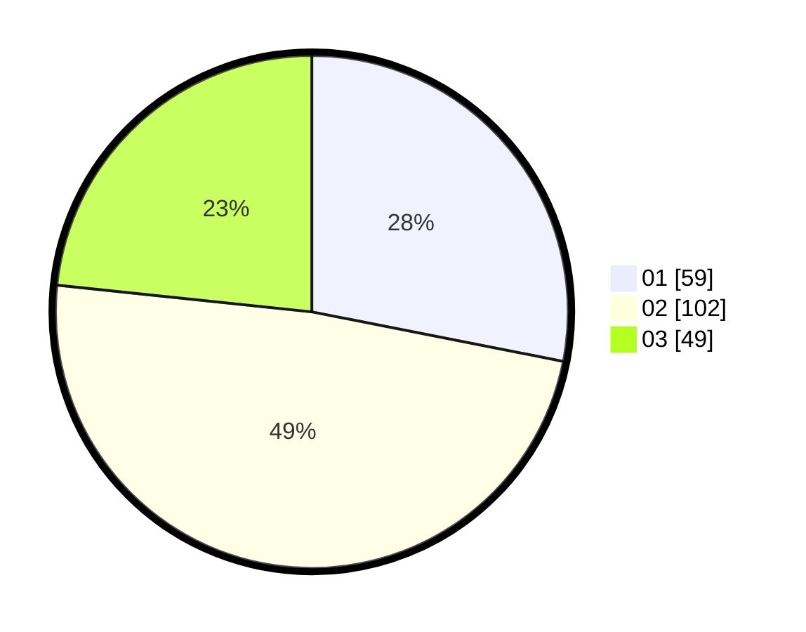

# Hasil

Hasil perolehan suara paslon dapat dilihat pada file paslon-01.txt, paslon-02.txt, dan paslon-03.txt.

Jika tidak ada, artinya data tersebut belum ada pada SIREKAP.

## Perolehan Suara

 * Paslon 01: **59**.
 * Paslon 02: **102**.
 * Paslon 03: **49**.

## Foto C Plano

https://sirekap-obj-formc.kpu.go.id/6938/pemilu/ppwp/31/73/01/10/05/3173011005313-20240215-005616--83e7b755-67b7-4ab8-9452-0e4f64833118.jpg

https://sirekap-obj-formc.kpu.go.id/6938/pemilu/ppwp/31/73/01/10/05/3173011005313-20240215-005829--bda7e1d5-e301-4af8-a9c4-aa9444da452c.jpg

https://sirekap-obj-formc.kpu.go.id/6938/pemilu/ppwp/31/73/01/10/05/3173011005313-20240215-010012--3696a6a4-3987-44c0-930d-96a439bb28cf.jpg
