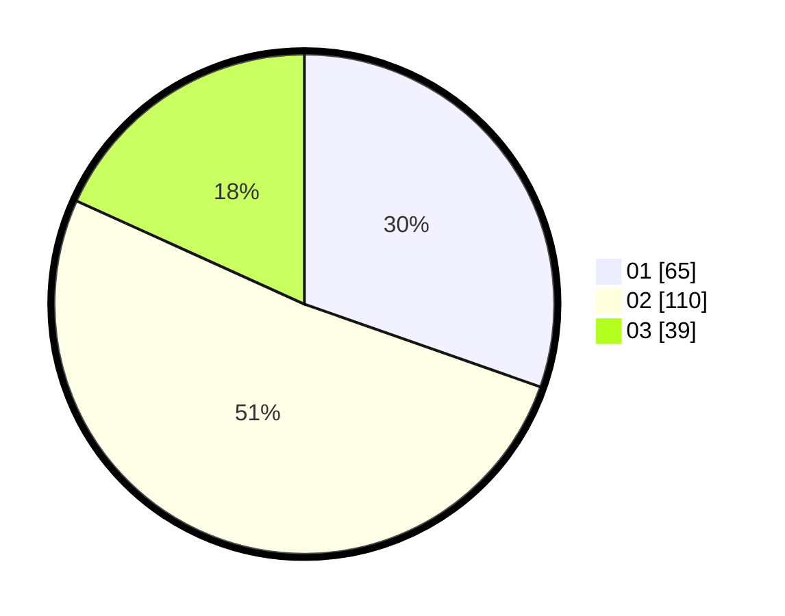

# Hasil

Hasil perolehan suara paslon dapat dilihat pada file paslon-01.txt, paslon-02.txt, dan paslon-03.txt.

Jika tidak ada, artinya data tersebut belum ada pada SIREKAP.

## Perolehan Suara

 * Paslon 01: **65**.
 * Paslon 02: **110**.
 * Paslon 03: **39**.

## Foto C Plano

https://sirekap-obj-formc.kpu.go.id/8b31/pemilu/ppwp/31/73/01/10/05/3173011005316-20240215-053000--991f27f2-a5c4-4708-ba08-4492ec58efb9.jpg

https://sirekap-obj-formc.kpu.go.id/8b31/pemilu/ppwp/31/73/01/10/05/3173011005316-20240215-052045--aa6d5a01-5931-43e3-8d54-0f7c5020bb02.jpg

https://sirekap-obj-formc.kpu.go.id/8b31/pemilu/ppwp/31/73/01/10/05/3173011005316-20240215-053043--e760b1fd-fefb-4b5c-927d-aa9b72b66fa4.jpg
