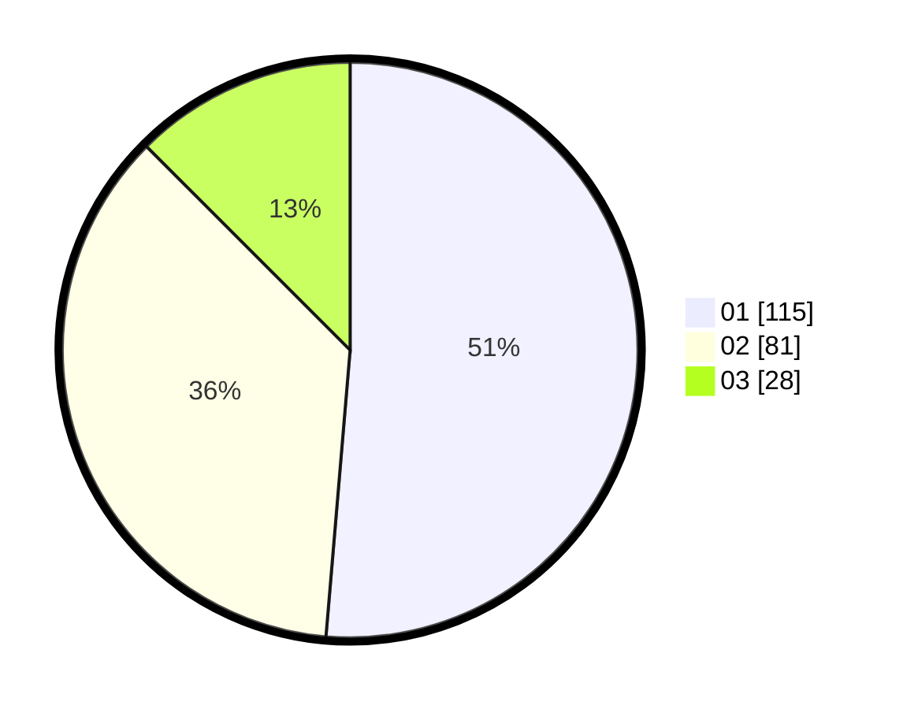

# Hasil

Hasil perolehan suara paslon dapat dilihat pada file paslon-01.txt, paslon-02.txt, dan paslon-03.txt.

Jika tidak ada, artinya data tersebut belum ada pada SIREKAP.

## Perolehan Suara

 * Paslon 01: **115**.
 * Paslon 02: **81**.
 * Paslon 03: **28**.

## Foto C Plano

https://sirekap-obj-formc.kpu.go.id/98db/pemilu/ppwp/31/73/01/10/05/3173011005320-20240215-205138--2b389391-ec20-403f-a7ee-15c82efa3270.jpg

https://sirekap-obj-formc.kpu.go.id/98db/pemilu/ppwp/31/73/01/10/05/3173011005320-20240215-205140--6bdcddd4-5517-443e-b614-595a5ab1c2cb.jpg

https://sirekap-obj-formc.kpu.go.id/98db/pemilu/ppwp/31/73/01/10/05/3173011005320-20240215-205139--54fe1be2-3499-41d2-8469-3e34800fa3b0.jpg

## DATA PEMILIH TETAP

Jumlah pemilih dalam DPT: **282**.
 * L: **140**.
 * P: **142**.

## DATA PENGGUNA HAK PILIH

Jumlah pengguna hak pilih dalam DPT: **227**.
 * L: **106**.
 * P: **121**.

Jumlah pengguna hak pilih dalam DPTb: **0**.
 * L: **0**.
 * P: **0**.

Jumlah pengguna hak pilih dalam DPK: **0**.
 * L: **0**.
 * P: **0**.

Jumlah pengguna hak pilih: **227**.
 * L: **106**.
 * P: **121**.

## JUMLAH SUARA SAH DAN TIDAK SAH

JUMLAH SELURUH SUARA SAH: **224**.

JUMLAH SUARA TIDAK SAH: **3**.

JUMLAH SELURUH SUARA SAH DAN SUARA TIDAK SAH: **227**.
