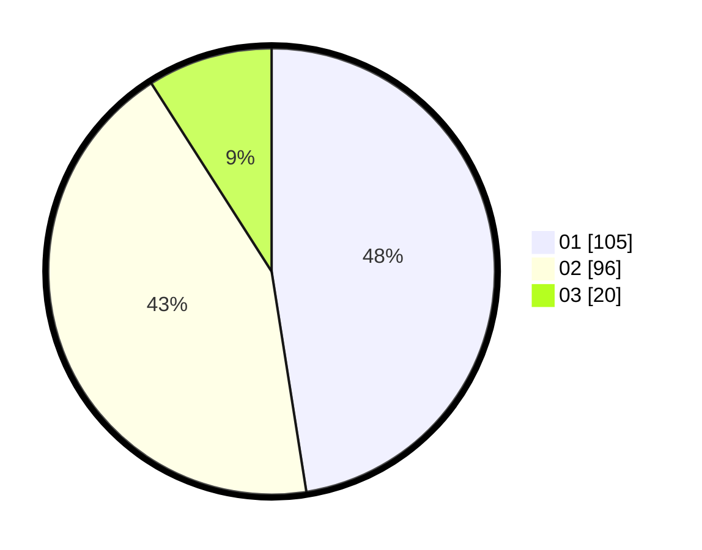

# Hasil

Hasil perolehan suara paslon dapat dilihat pada file paslon-01.txt, paslon-02.txt, dan paslon-03.txt.

Jika tidak ada, artinya data tersebut belum ada pada SIREKAP.

## Perolehan Suara

 * Paslon 01: **105**.
 * Paslon 02: **96**.
 * Paslon 03: **20**.

## Foto C Plano

https://sirekap-obj-formc.kpu.go.id/e03c/pemilu/ppwp/31/73/01/10/05/3173011005321-20240215-011912--731a9758-f06c-4959-bf17-711d104d6a5e.jpg

https://sirekap-obj-formc.kpu.go.id/e03c/pemilu/ppwp/31/73/01/10/05/3173011005321-20240215-012033--3c8fd95f-a29a-4098-9f42-a7695c07a403.jpg

https://sirekap-obj-formc.kpu.go.id/e03c/pemilu/ppwp/31/73/01/10/05/3173011005321-20240215-012404--c8b1f368-5e5b-4732-bf14-e3f1f6ab5b66.jpg
