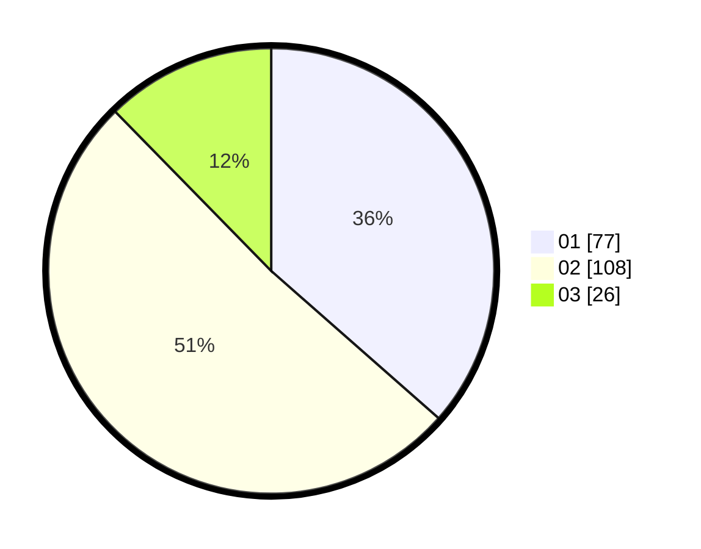

# Hasil

Hasil perolehan suara paslon dapat dilihat pada file paslon-01.txt, paslon-02.txt, dan paslon-03.txt.

Jika tidak ada, artinya data tersebut belum ada pada SIREKAP.

## Perolehan Suara

 * Paslon 01: **77**.
 * Paslon 02: **108**.
 * Paslon 03: **26**.

## Foto C Plano

https://sirekap-obj-formc.kpu.go.id/eaba/pemilu/ppwp/31/73/01/10/05/3173011005322-20240214-215109--b4c8d523-8727-4570-b4fb-8c51808de783.jpg

https://sirekap-obj-formc.kpu.go.id/eaba/pemilu/ppwp/31/73/01/10/05/3173011005322-20240214-220824--27b4cf02-e939-48ef-a74e-a00f69deb438.jpg

https://sirekap-obj-formc.kpu.go.id/eaba/pemilu/ppwp/31/73/01/10/05/3173011005322-20240214-221108--9ccec054-7426-4d56-8cd0-020f07f46849.jpg
