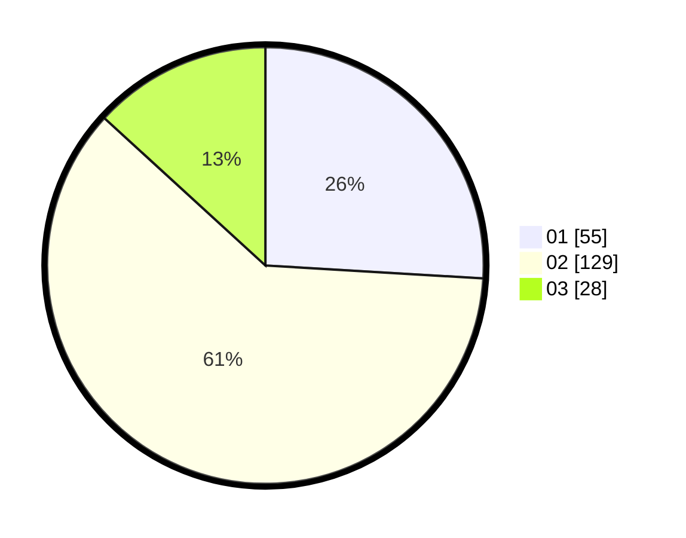

# Hasil

Hasil perolehan suara paslon dapat dilihat pada file paslon-01.txt, paslon-02.txt, dan paslon-03.txt.

Jika tidak ada, artinya data tersebut belum ada pada SIREKAP.

## Perolehan Suara

 * Paslon 01: **55**.
 * Paslon 02: **129**.
 * Paslon 03: **28**.

## Foto C Plano

https://sirekap-obj-formc.kpu.go.id/555e/pemilu/ppwp/31/73/01/10/05/3173011005324-20240215-224941--8d3a176c-f269-4ae7-a6c7-fbe0e267ee9d.jpg

https://sirekap-obj-formc.kpu.go.id/555e/pemilu/ppwp/31/73/01/10/05/3173011005324-20240215-224945--41cb8254-9587-45ff-a2ff-20fac5da4068.jpg

https://sirekap-obj-formc.kpu.go.id/555e/pemilu/ppwp/31/73/01/10/05/3173011005324-20240215-224943--3b9d8204-a284-415e-983d-adf6a40610fa.jpg

## DATA PEMILIH TETAP

Jumlah pemilih dalam DPT: **281**.
 * L: **137**.
 * P: **144**.

## DATA PENGGUNA HAK PILIH

Jumlah pengguna hak pilih dalam DPT: **218**.
 * L: **107**.
 * P: **111**.

Jumlah pengguna hak pilih dalam DPTb: **5**.
 * L: **3**.
 * P: **2**.

Jumlah pengguna hak pilih dalam DPK: **1**.
 * L: **0**.
 * P: **1**.

Jumlah pengguna hak pilih: **224**.
 * L: **110**.
 * P: **114**.

## JUMLAH SUARA SAH DAN TIDAK SAH

JUMLAH SELURUH SUARA SAH: **212**.

JUMLAH SUARA TIDAK SAH: **12**.

JUMLAH SELURUH SUARA SAH DAN SUARA TIDAK SAH: **224**.
