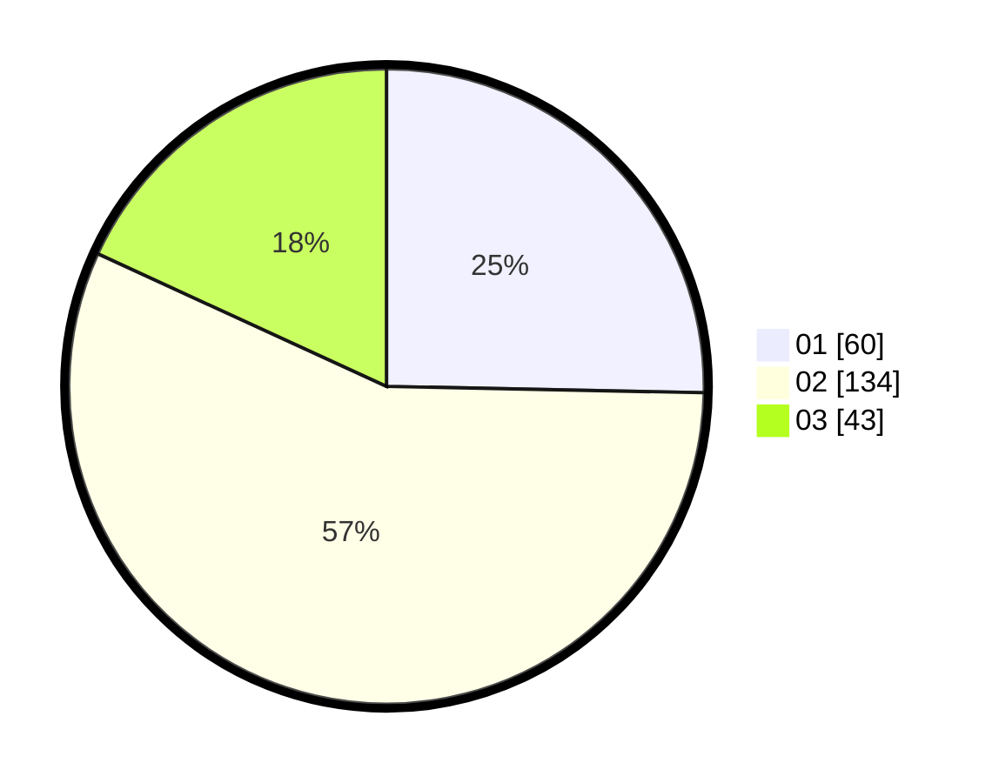

# Hasil

Hasil perolehan suara paslon dapat dilihat pada file paslon-01.txt, paslon-02.txt, dan paslon-03.txt.

Jika tidak ada, artinya data tersebut belum ada pada SIREKAP.

## Perolehan Suara

 * Paslon 01: **60**.
 * Paslon 02: **134**.
 * Paslon 03: **43**.

## Foto C Plano

https://sirekap-obj-formc.kpu.go.id/a3a9/pemilu/ppwp/31/73/01/10/05/3173011005329-20240214-232906--f3203be5-11e2-4df2-99b1-efd379493c34.jpg

https://sirekap-obj-formc.kpu.go.id/a3a9/pemilu/ppwp/31/73/01/10/05/3173011005329-20240214-224316--1b644db6-de33-48ec-b867-d905a2e501f0.jpg

https://sirekap-obj-formc.kpu.go.id/a3a9/pemilu/ppwp/31/73/01/10/05/3173011005329-20240214-224447--0020e5ef-19d2-440b-8872-abe03a0ead39.jpg
