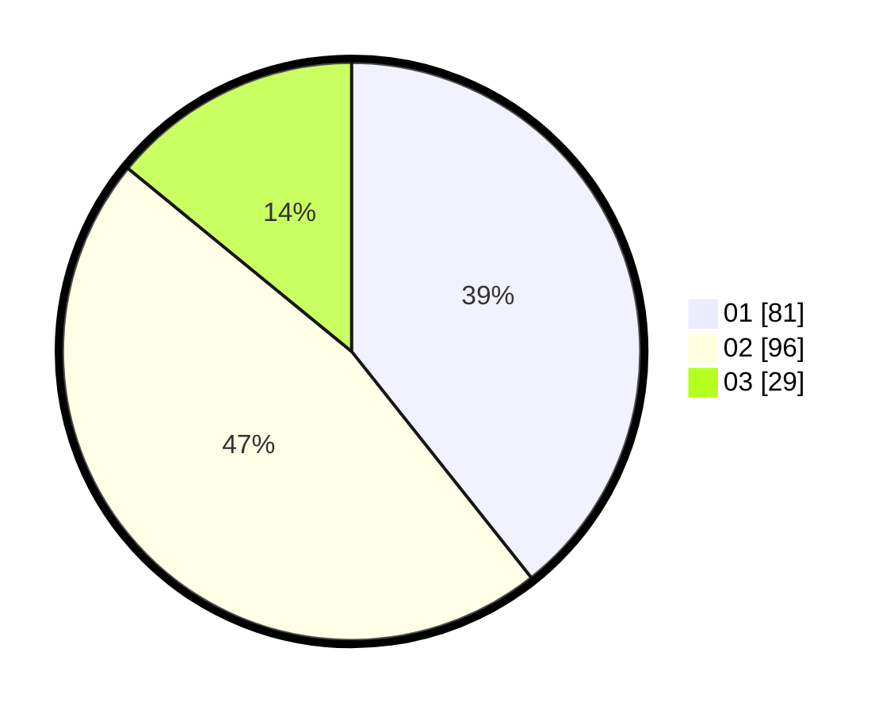

# Hasil

Hasil perolehan suara paslon dapat dilihat pada file paslon-01.txt, paslon-02.txt, dan paslon-03.txt.

Jika tidak ada, artinya data tersebut belum ada pada SIREKAP.

## Perolehan Suara

 * Paslon 01: **81**.
 * Paslon 02: **96**.
 * Paslon 03: **29**.

## Foto C Plano

https://sirekap-obj-formc.kpu.go.id/06a0/pemilu/ppwp/31/73/01/10/05/3173011005336-20240216-175812--94deec82-03ed-448b-bd6c-82260b13dbf9.jpg

https://sirekap-obj-formc.kpu.go.id/06a0/pemilu/ppwp/31/73/01/10/05/3173011005336-20240216-175813--d36d81aa-d7a5-4bbf-87a8-175570ae819d.jpg

https://sirekap-obj-formc.kpu.go.id/06a0/pemilu/ppwp/31/73/01/10/05/3173011005336-20240216-175813--f9ee71a2-d925-4cb3-ae5d-72e3f19fbe8d.jpg

## DATA PEMILIH TETAP

Jumlah pemilih dalam DPT: **277**.
 * L: **137**.
 * P: **140**.

## DATA PENGGUNA HAK PILIH

Jumlah pengguna hak pilih dalam DPT: **208**.
 * L: **103**.
 * P: **105**.

Jumlah pengguna hak pilih dalam DPTb: **0**.
 * L: **0**.
 * P: **0**.

Jumlah pengguna hak pilih dalam DPK: **0**.
 * L: **0**.
 * P: **0**.

Jumlah pengguna hak pilih: **208**.
 * L: **103**.
 * P: **105**.

## JUMLAH SUARA SAH DAN TIDAK SAH

JUMLAH SELURUH SUARA SAH: **206**.

JUMLAH SUARA TIDAK SAH: **2**.

JUMLAH SELURUH SUARA SAH DAN SUARA TIDAK SAH: **208**.
