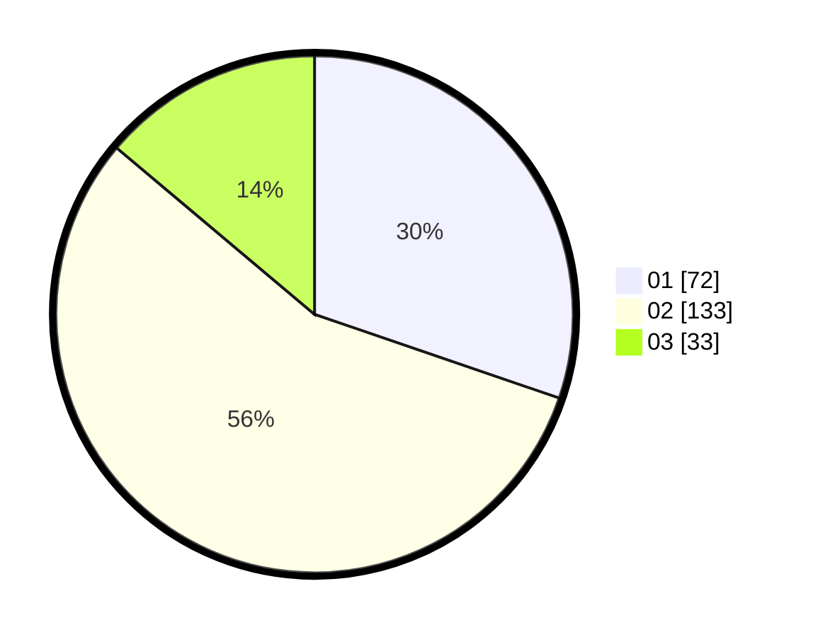

# Hasil

Hasil perolehan suara paslon dapat dilihat pada file paslon-01.txt, paslon-02.txt, dan paslon-03.txt.

Jika tidak ada, artinya data tersebut belum ada pada SIREKAP.

## Perolehan Suara

 * Paslon 01: **72**.
 * Paslon 02: **133**.
 * Paslon 03: **33**.

## Foto C Plano

https://sirekap-obj-formc.kpu.go.id/35c9/pemilu/ppwp/31/73/01/10/05/3173011005343-20240215-004836--62242519-e812-4db2-b681-7f1baeaa7791.jpg

https://sirekap-obj-formc.kpu.go.id/35c9/pemilu/ppwp/31/73/01/10/05/3173011005343-20240215-004925--b38a8407-58a3-4ccb-aadc-f2a9e2d39214.jpg

https://sirekap-obj-formc.kpu.go.id/35c9/pemilu/ppwp/31/73/01/10/05/3173011005343-20240215-005046--4621d3b6-26de-434f-bdf7-df6e12c73ef9.jpg
