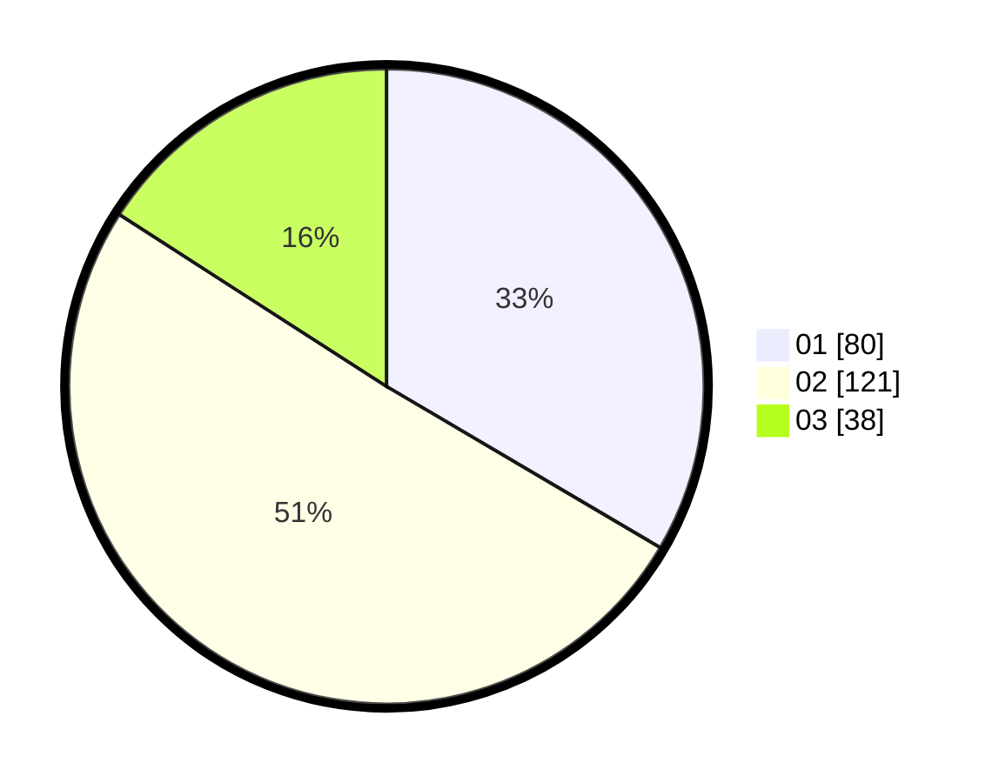

# Hasil

Hasil perolehan suara paslon dapat dilihat pada file paslon-01.txt, paslon-02.txt, dan paslon-03.txt.

Jika tidak ada, artinya data tersebut belum ada pada SIREKAP.

## Perolehan Suara

 * Paslon 01: **80**.
 * Paslon 02: **121**.
 * Paslon 03: **38**.

## Foto C Plano

https://sirekap-obj-formc.kpu.go.id/d55a/pemilu/ppwp/31/73/01/10/05/3173011005344-20240214-215138--833c8446-1e74-43af-b6e7-07b1d38fb8b2.jpg

https://sirekap-obj-formc.kpu.go.id/d55a/pemilu/ppwp/31/73/01/10/05/3173011005344-20240214-215817--688ce928-8cd3-4a68-bbc1-0c135b0be93f.jpg

https://sirekap-obj-formc.kpu.go.id/d55a/pemilu/ppwp/31/73/01/10/05/3173011005344-20240214-220125--080607b2-aa22-44f7-95e2-d4c4c4ff6848.jpg
