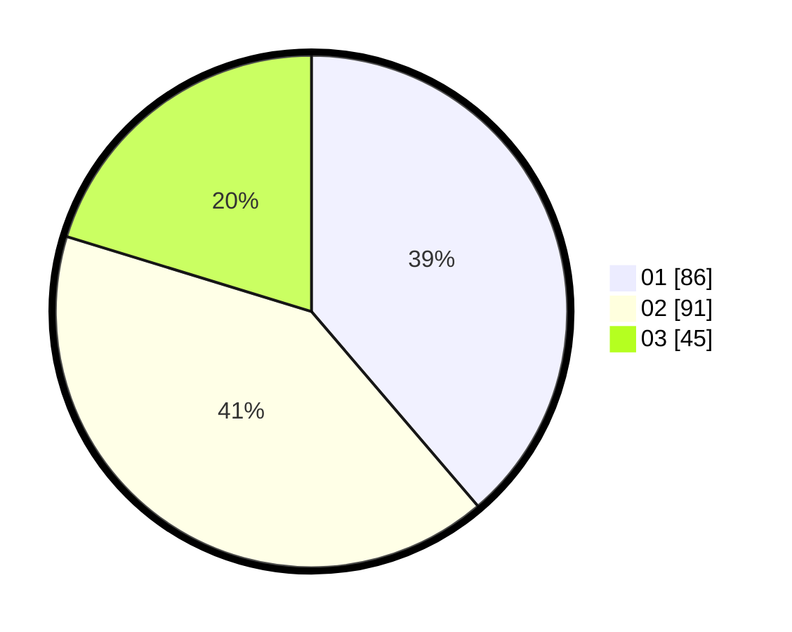

# Hasil

Hasil perolehan suara paslon dapat dilihat pada file paslon-01.txt, paslon-02.txt, dan paslon-03.txt.

Jika tidak ada, artinya data tersebut belum ada pada SIREKAP.

## Perolehan Suara

 * Paslon 01: **86**.
 * Paslon 02: **91**.
 * Paslon 03: **45**.

## Foto C Plano

https://sirekap-obj-formc.kpu.go.id/6c7d/pemilu/ppwp/31/73/01/10/05/3173011005347-20240214-190742--91d4d343-d401-486a-b489-cad277d492d0.jpg

https://sirekap-obj-formc.kpu.go.id/6c7d/pemilu/ppwp/31/73/01/10/05/3173011005347-20240214-190254--fa24dab2-1ee9-4ab6-8a01-fcd4f7ccbb01.jpg

https://sirekap-obj-formc.kpu.go.id/6c7d/pemilu/ppwp/31/73/01/10/05/3173011005347-20240214-191838--64bf6d33-a63f-441d-b4ec-c7d9d25af3f9.jpg

## DATA PEMILIH TETAP

Jumlah pemilih dalam DPT: **265**.
 * L: **119**.
 * P: **146**.

## DATA PENGGUNA HAK PILIH

Jumlah pengguna hak pilih dalam DPT: **217**.
 * L: **96**.
 * P: **121**.

Jumlah pengguna hak pilih dalam DPTb: **2**.
 * L: **0**.
 * P: **2**.

Jumlah pengguna hak pilih dalam DPK: **3**.
 * L: **2**.
 * P: **1**.

Jumlah pengguna hak pilih: **222**.
 * L: **98**.
 * P: **124**.

## JUMLAH SUARA SAH DAN TIDAK SAH

JUMLAH SELURUH SUARA SAH: **222**.

JUMLAH SUARA TIDAK SAH: **0**.

JUMLAH SELURUH SUARA SAH DAN SUARA TIDAK SAH: **222**.
