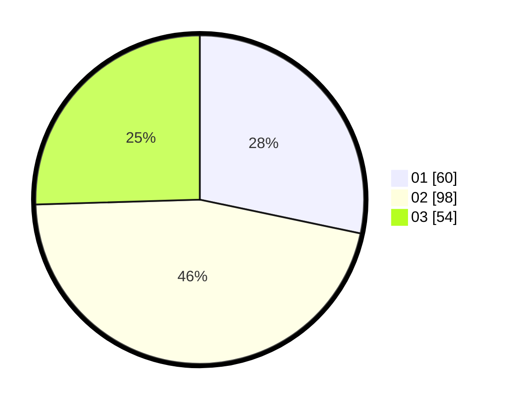

# Hasil

Hasil perolehan suara paslon dapat dilihat pada file paslon-01.txt, paslon-02.txt, dan paslon-03.txt.

Jika tidak ada, artinya data tersebut belum ada pada SIREKAP.

## Perolehan Suara

 * Paslon 01: **60**.
 * Paslon 02: **98**.
 * Paslon 03: **54**.

## Foto C Plano

https://sirekap-obj-formc.kpu.go.id/7862/pemilu/ppwp/31/73/01/10/05/3173011005350-20240216-030616--39f21677-bd37-42c0-b23f-31dc3e48f06d.jpg

https://sirekap-obj-formc.kpu.go.id/7862/pemilu/ppwp/31/73/01/10/05/3173011005350-20240216-030633--4db3195c-6478-4640-82fe-56e1993b204f.jpg

https://sirekap-obj-formc.kpu.go.id/7862/pemilu/ppwp/31/73/01/10/05/3173011005350-20240216-031540--eeaf2fff-5620-4a14-8470-70bc8bb9c06e.jpg

## DATA PEMILIH TETAP

Jumlah pemilih dalam DPT: **272**.
 * L: **136**.
 * P: **136**.

## DATA PENGGUNA HAK PILIH

Jumlah pengguna hak pilih dalam DPT: **213**.
 * L: **106**.
 * P: **107**.

Jumlah pengguna hak pilih dalam DPTb: **1**.
 * L: **0**.
 * P: **1**.

Jumlah pengguna hak pilih dalam DPK: **1**.
 * L: **1**.
 * P: **0**.

Jumlah pengguna hak pilih: **215**.
 * L: **107**.
 * P: **108**.

## JUMLAH SUARA SAH DAN TIDAK SAH

JUMLAH SELURUH SUARA SAH: **212**.

JUMLAH SUARA TIDAK SAH: **3**.

JUMLAH SELURUH SUARA SAH DAN SUARA TIDAK SAH: **215**.
