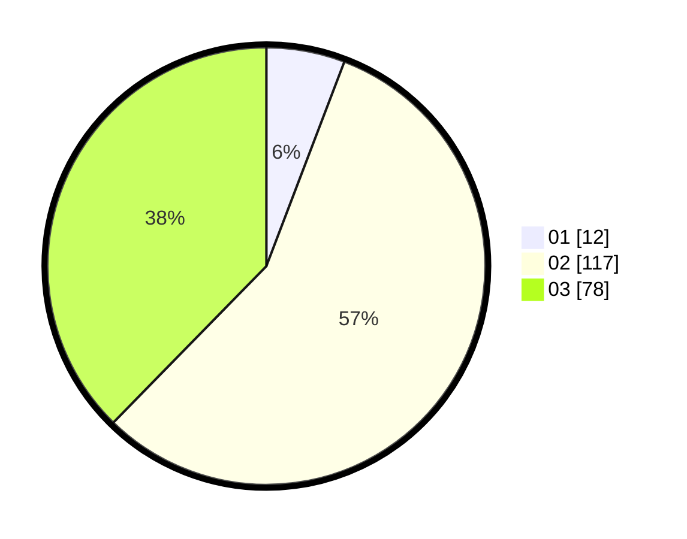

# Hasil

Hasil perolehan suara paslon dapat dilihat pada file paslon-01.txt, paslon-02.txt, dan paslon-03.txt.

Jika tidak ada, artinya data tersebut belum ada pada SIREKAP.

## Perolehan Suara

 * Paslon 01: **12**.
 * Paslon 02: **117**.
 * Paslon 03: **78**.

## Foto C Plano

https://sirekap-obj-formc.kpu.go.id/6803/pemilu/ppwp/31/73/01/10/05/3173011005353-20240217-092629--a1725c85-b0be-42e2-99ec-f872ec93a08c.jpg

https://sirekap-obj-formc.kpu.go.id/6803/pemilu/ppwp/31/73/01/10/05/3173011005353-20240217-092630--0bee8abf-df6b-4690-8343-68917dfc9d37.jpg

https://sirekap-obj-formc.kpu.go.id/6803/pemilu/ppwp/31/73/01/10/05/3173011005353-20240217-092629--7c95ba65-ccb8-4b05-8818-1c9d1728ebc9.jpg

## DATA PEMILIH TETAP

Jumlah pemilih dalam DPT: **280**.
 * L: **122**.
 * P: **158**.

## DATA PENGGUNA HAK PILIH

Jumlah pengguna hak pilih dalam DPT: **209**.
 * L: **92**.
 * P: **117**.

Jumlah pengguna hak pilih dalam DPTb: **0**.
 * L: **0**.
 * P: **0**.

Jumlah pengguna hak pilih dalam DPK: **3**.
 * L: **1**.
 * P: **2**.

Jumlah pengguna hak pilih: **212**.
 * L: **93**.
 * P: **119**.

## JUMLAH SUARA SAH DAN TIDAK SAH

JUMLAH SELURUH SUARA SAH: **207**.

JUMLAH SUARA TIDAK SAH: **5**.

JUMLAH SELURUH SUARA SAH DAN SUARA TIDAK SAH: **212**.
