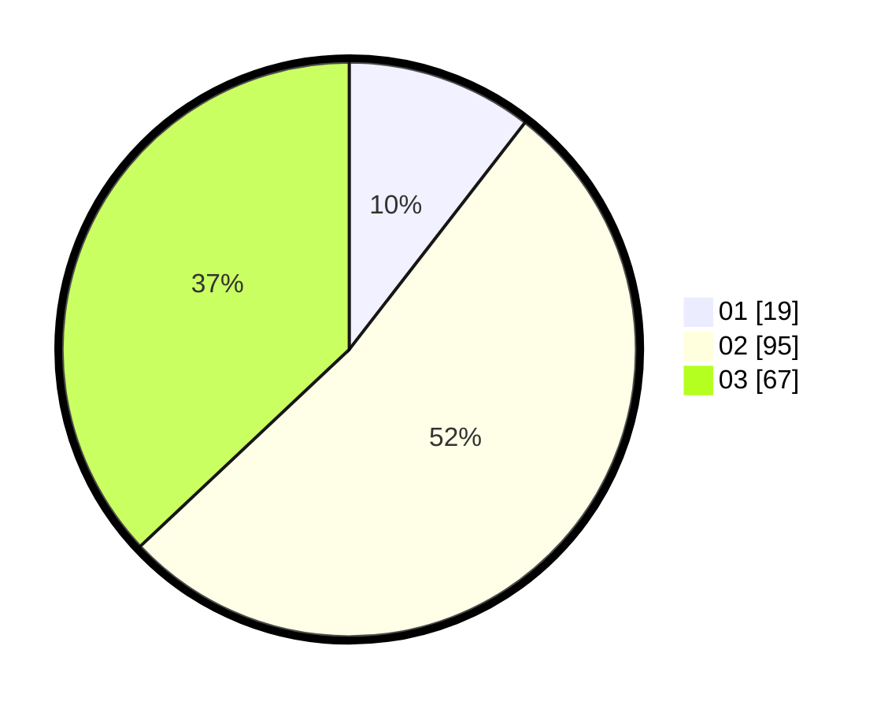

# Hasil

Hasil perolehan suara paslon dapat dilihat pada file paslon-01.txt, paslon-02.txt, dan paslon-03.txt.

Jika tidak ada, artinya data tersebut belum ada pada SIREKAP.

## Perolehan Suara

 * Paslon 01: **19**.
 * Paslon 02: **95**.
 * Paslon 03: **67**.

## Foto C Plano

https://sirekap-obj-formc.kpu.go.id/4de0/pemilu/ppwp/31/73/01/10/05/3173011005355-20240216-130132--137b6c1c-6dde-440d-b840-eddd07b32e17.jpg

https://sirekap-obj-formc.kpu.go.id/4de0/pemilu/ppwp/31/73/01/10/05/3173011005355-20240216-130135--36be050c-ef01-428f-a24f-6c41bb4b8ce5.jpg

https://sirekap-obj-formc.kpu.go.id/4de0/pemilu/ppwp/31/73/01/10/05/3173011005355-20240216-130134--88f02fa8-767f-4e53-9594-982e38c9f2e2.jpg

## DATA PEMILIH TETAP

Jumlah pemilih dalam DPT: **275**.
 * L: **131**.
 * P: **144**.

## DATA PENGGUNA HAK PILIH

Jumlah pengguna hak pilih dalam DPT: **181**.
 * L: **85**.
 * P: **96**.

Jumlah pengguna hak pilih dalam DPTb: **0**.
 * L: **0**.
 * P: **0**.

Jumlah pengguna hak pilih dalam DPK: **1**.
 * L: **0**.
 * P: **1**.

Jumlah pengguna hak pilih: **182**.
 * L: **85**.
 * P: **97**.

## JUMLAH SUARA SAH DAN TIDAK SAH

JUMLAH SELURUH SUARA SAH: **181**.

JUMLAH SUARA TIDAK SAH: **1**.

JUMLAH SELURUH SUARA SAH DAN SUARA TIDAK SAH: **182**.
