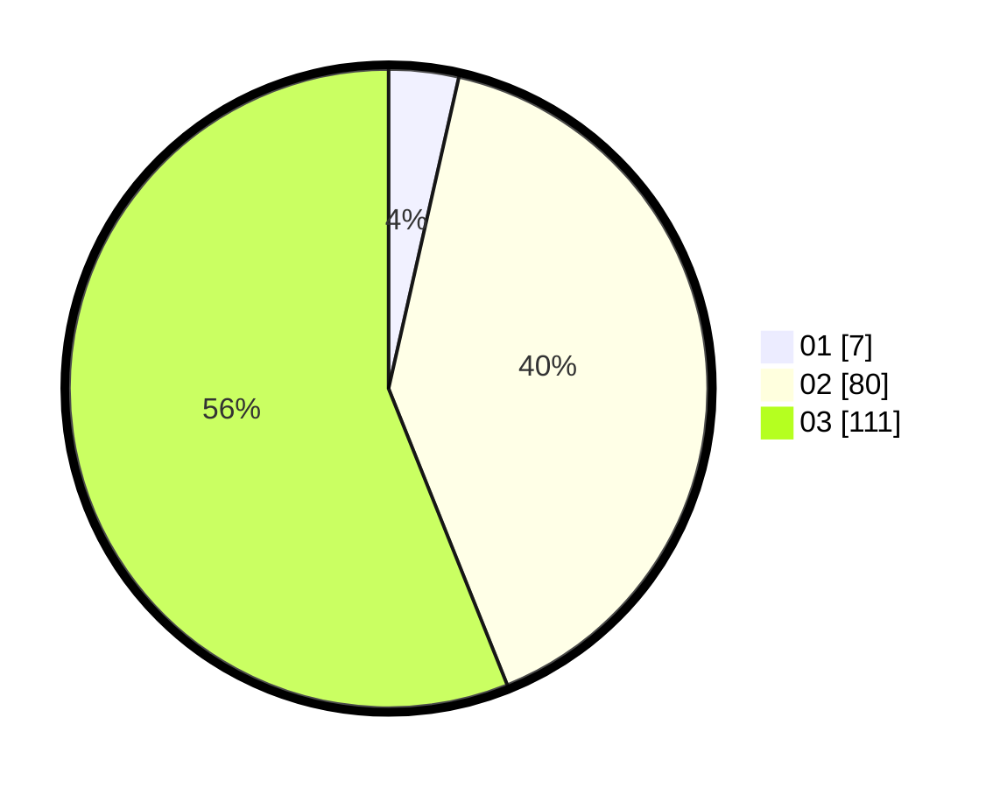

# Hasil

Hasil perolehan suara paslon dapat dilihat pada file paslon-01.txt, paslon-02.txt, dan paslon-03.txt.

Jika tidak ada, artinya data tersebut belum ada pada SIREKAP.

## Perolehan Suara

 * Paslon 01: **7**.
 * Paslon 02: **80**.
 * Paslon 03: **111**.

## Foto C Plano

https://sirekap-obj-formc.kpu.go.id/2900/pemilu/ppwp/31/73/01/10/05/3173011005358-20240214-191531--80106a57-f87e-4657-b5ef-2aa0a58788f1.jpg

https://sirekap-obj-formc.kpu.go.id/2900/pemilu/ppwp/31/73/01/10/05/3173011005358-20240214-191619--3e6d6a7b-c25f-4fe4-98ce-19dfd3c91f98.jpg

https://sirekap-obj-formc.kpu.go.id/2900/pemilu/ppwp/31/73/01/10/05/3173011005358-20240214-190214--57d87290-173a-4666-8ce4-ebd89a14bc5a.jpg

## DATA PEMILIH TETAP

Jumlah pemilih dalam DPT: **254**.
 * L: **130**.
 * P: **124**.

## DATA PENGGUNA HAK PILIH

Jumlah pengguna hak pilih dalam DPT: **201**.
 * L: **106**.
 * P: **95**.

Jumlah pengguna hak pilih dalam DPTb: **1**.
 * L: **0**.
 * P: **1**.

Jumlah pengguna hak pilih dalam DPK: **0**.
 * L: **0**.
 * P: **0**.

Jumlah pengguna hak pilih: **202**.
 * L: **106**.
 * P: **96**.

## JUMLAH SUARA SAH DAN TIDAK SAH

JUMLAH SELURUH SUARA SAH: **198**.

JUMLAH SUARA TIDAK SAH: **4**.

JUMLAH SELURUH SUARA SAH DAN SUARA TIDAK SAH: **202**.
