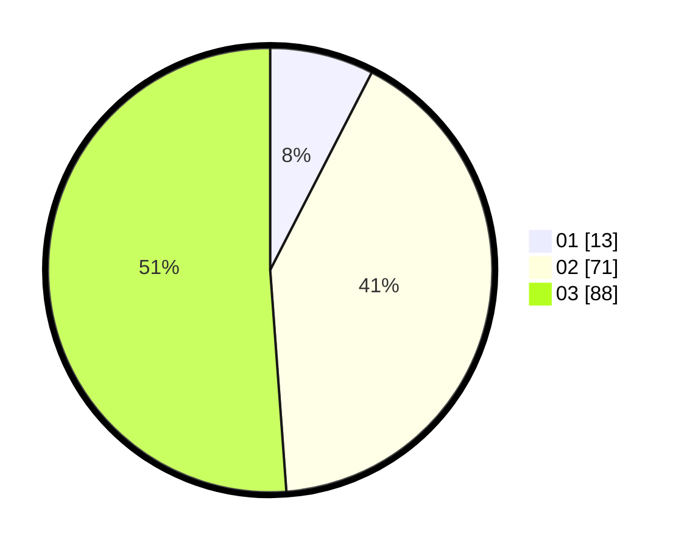

# Hasil

Hasil perolehan suara paslon dapat dilihat pada file paslon-01.txt, paslon-02.txt, dan paslon-03.txt.

Jika tidak ada, artinya data tersebut belum ada pada SIREKAP.

## Perolehan Suara

 * Paslon 01: **13**.
 * Paslon 02: **71**.
 * Paslon 03: **88**.

## Foto C Plano

https://sirekap-obj-formc.kpu.go.id/9bc5/pemilu/ppwp/31/73/01/10/05/3173011005361-20240215-012116--e69ba39d-44c3-438e-9c89-7a8f4ce852b2.jpg

https://sirekap-obj-formc.kpu.go.id/9bc5/pemilu/ppwp/31/73/01/10/05/3173011005361-20240215-012255--47988340-25d6-49d5-8fcb-e196185570cb.jpg

https://sirekap-obj-formc.kpu.go.id/9bc5/pemilu/ppwp/31/73/01/10/05/3173011005361-20240215-012418--b82dc04e-91fc-46d6-9ccd-fb6b9acaed63.jpg
