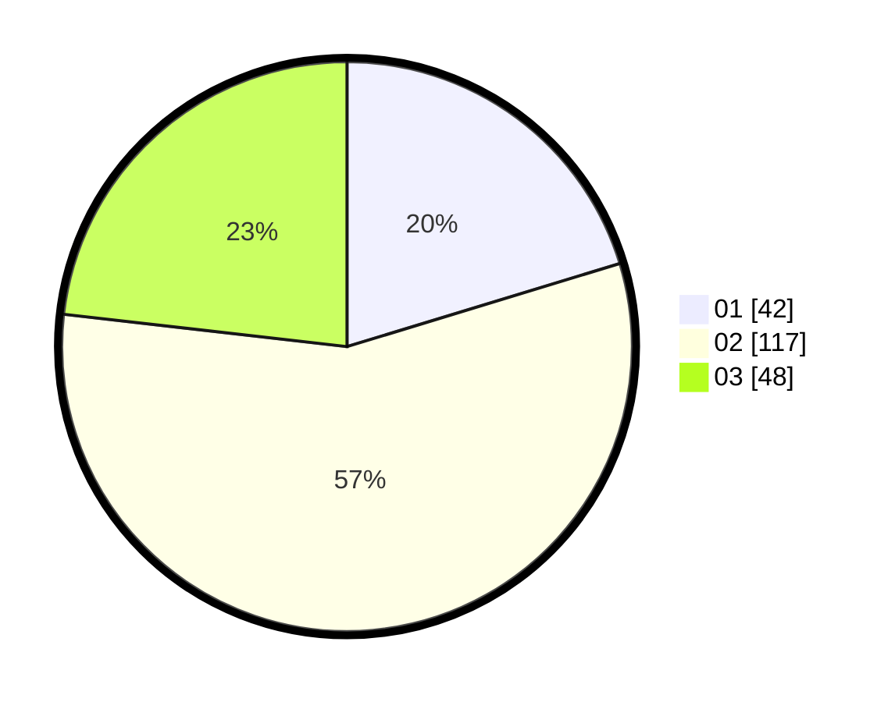

# Hasil

Hasil perolehan suara paslon dapat dilihat pada file paslon-01.txt, paslon-02.txt, dan paslon-03.txt.

Jika tidak ada, artinya data tersebut belum ada pada SIREKAP.

## Perolehan Suara

 * Paslon 01: **42**.
 * Paslon 02: **117**.
 * Paslon 03: **48**.

## Foto C Plano

https://sirekap-obj-formc.kpu.go.id/8fe4/pemilu/ppwp/31/73/01/10/05/3173011005364-20240214-200322--e8ee0c41-14c1-49cb-bc99-ae37e58095a9.jpg

https://sirekap-obj-formc.kpu.go.id/8fe4/pemilu/ppwp/31/73/01/10/05/3173011005364-20240214-200427--f2059cf9-5af6-404a-b195-dd289380d31b.jpg

https://sirekap-obj-formc.kpu.go.id/8fe4/pemilu/ppwp/31/73/01/10/05/3173011005364-20240214-200627--34399111-2172-4441-a151-8051b3da686c.jpg

## DATA PEMILIH TETAP

Jumlah pemilih dalam DPT: **281**.
 * L: **153**.
 * P: **128**.

## DATA PENGGUNA HAK PILIH

Jumlah pengguna hak pilih dalam DPT: **211**.
 * L: **106**.
 * P: **105**.

Jumlah pengguna hak pilih dalam DPTb: **0**.
 * L: **0**.
 * P: **0**.

Jumlah pengguna hak pilih dalam DPK: **0**.
 * L: **0**.
 * P: **0**.

Jumlah pengguna hak pilih: **211**.
 * L: **106**.
 * P: **105**.

## JUMLAH SUARA SAH DAN TIDAK SAH

JUMLAH SELURUH SUARA SAH: **207**.

JUMLAH SUARA TIDAK SAH: **4**.

JUMLAH SELURUH SUARA SAH DAN SUARA TIDAK SAH: **211**.
