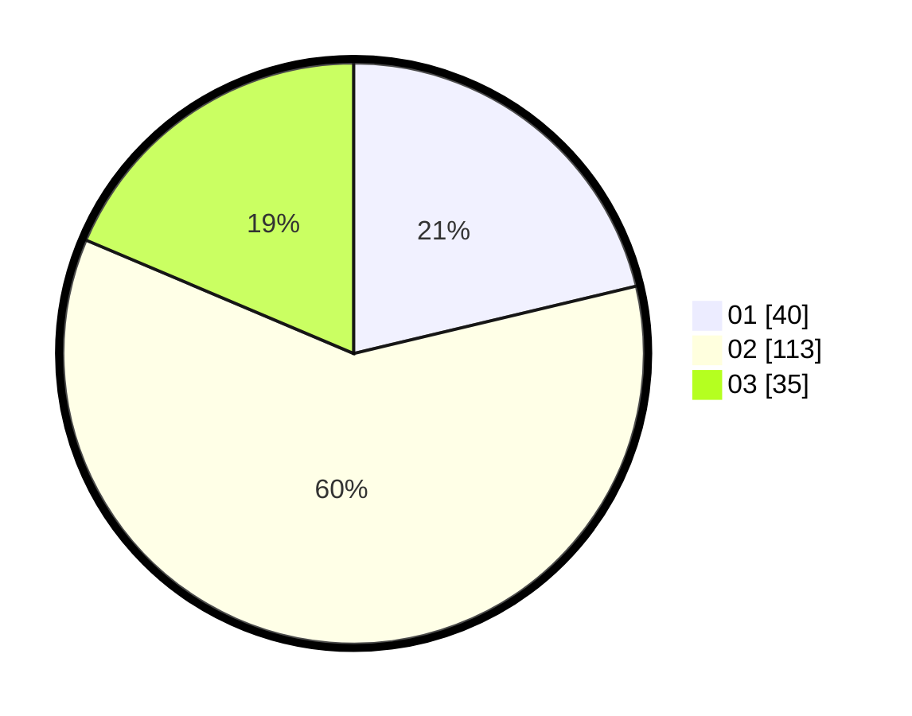

# Hasil

Hasil perolehan suara paslon dapat dilihat pada file paslon-01.txt, paslon-02.txt, dan paslon-03.txt.

Jika tidak ada, artinya data tersebut belum ada pada SIREKAP.

## Perolehan Suara

 * Paslon 01: **40**.
 * Paslon 02: **113**.
 * Paslon 03: **35**.

## Foto C Plano

https://sirekap-obj-formc.kpu.go.id/e309/pemilu/ppwp/31/73/01/10/05/3173011005367-20240214-235516--bd1d0387-d1d3-409a-ab40-3cd3b4f1fe7d.jpg

https://sirekap-obj-formc.kpu.go.id/e309/pemilu/ppwp/31/73/01/10/05/3173011005367-20240214-222127--8c4b7018-ab76-4391-8732-3adcea3bf594.jpg

https://sirekap-obj-formc.kpu.go.id/e309/pemilu/ppwp/31/73/01/10/05/3173011005367-20240214-191844--efcb717a-6038-4187-8237-62effe1961d3.jpg
