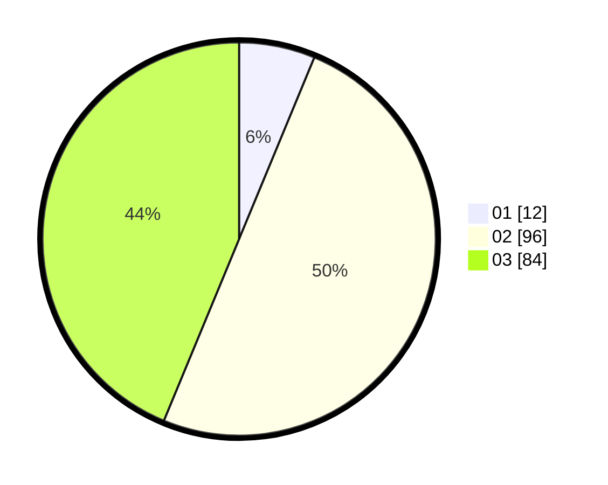

# Hasil

Hasil perolehan suara paslon dapat dilihat pada file paslon-01.txt, paslon-02.txt, dan paslon-03.txt.

Jika tidak ada, artinya data tersebut belum ada pada SIREKAP.

## Perolehan Suara

 * Paslon 01: **12**.
 * Paslon 02: **96**.
 * Paslon 03: **84**.

## Foto C Plano

https://sirekap-obj-formc.kpu.go.id/3fc3/pemilu/ppwp/31/73/01/10/05/3173011005370-20240216-132201--ceed379a-7d3e-411e-870a-2b089b3e8594.jpg

https://sirekap-obj-formc.kpu.go.id/3fc3/pemilu/ppwp/31/73/01/10/05/3173011005370-20240216-132202--75023e91-c522-4b61-8b4a-4e517c6d262c.jpg

https://sirekap-obj-formc.kpu.go.id/3fc3/pemilu/ppwp/31/73/01/10/05/3173011005370-20240216-132201--99c15535-e7cf-4951-bc86-724432df23df.jpg

## DATA PEMILIH TETAP

Jumlah pemilih dalam DPT: **275**.
 * L: **124**.
 * P: **151**.

## DATA PENGGUNA HAK PILIH

Jumlah pengguna hak pilih dalam DPT: **193**.
 * L: **85**.
 * P: **108**.

Jumlah pengguna hak pilih dalam DPTb: **3**.
 * L: **2**.
 * P: **1**.

Jumlah pengguna hak pilih dalam DPK: **2**.
 * L: **2**.
 * P: **0**.

Jumlah pengguna hak pilih: **198**.
 * L: **89**.
 * P: **109**.

## JUMLAH SUARA SAH DAN TIDAK SAH

JUMLAH SELURUH SUARA SAH: **192**.

JUMLAH SUARA TIDAK SAH: **6**.

JUMLAH SELURUH SUARA SAH DAN SUARA TIDAK SAH: **198**.
