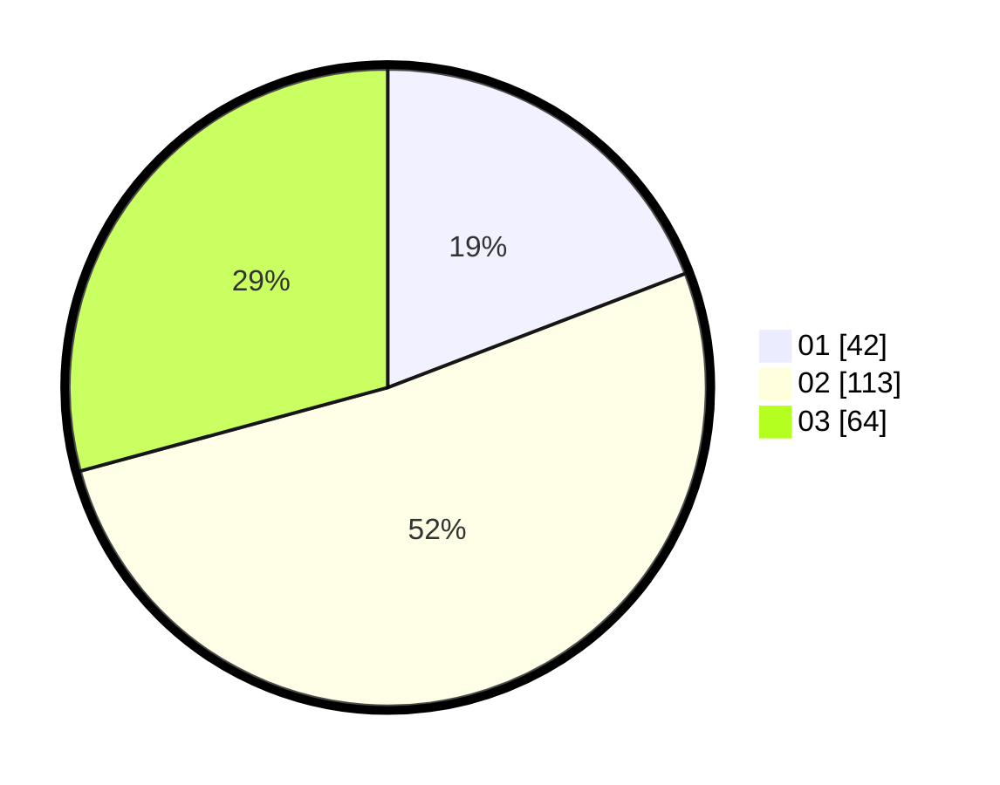

# Hasil

Hasil perolehan suara paslon dapat dilihat pada file paslon-01.txt, paslon-02.txt, dan paslon-03.txt.

Jika tidak ada, artinya data tersebut belum ada pada SIREKAP.

## Perolehan Suara

 * Paslon 01: **42**.
 * Paslon 02: **113**.
 * Paslon 03: **64**.

## Foto C Plano

https://sirekap-obj-formc.kpu.go.id/117c/pemilu/ppwp/31/73/01/10/05/3173011005371-20240215-002308--18016e85-ca80-47ab-a6fc-8e5d8c4efb23.jpg

https://sirekap-obj-formc.kpu.go.id/117c/pemilu/ppwp/31/73/01/10/05/3173011005371-20240215-002326--e0bad75a-1415-49af-90b3-01c1cb67ad30.jpg

https://sirekap-obj-formc.kpu.go.id/117c/pemilu/ppwp/31/73/01/10/05/3173011005371-20240215-002350--5c4edc5d-1e51-4a4d-8625-ad2c8377e8db.jpg
