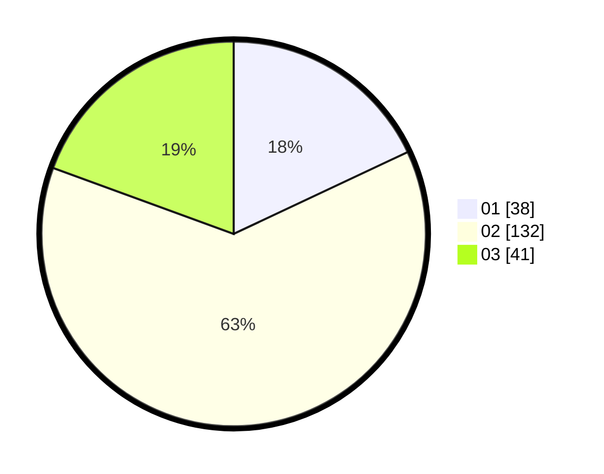

# Hasil

Hasil perolehan suara paslon dapat dilihat pada file paslon-01.txt, paslon-02.txt, dan paslon-03.txt.

Jika tidak ada, artinya data tersebut belum ada pada SIREKAP.

## Perolehan Suara

 * Paslon 01: **38**.
 * Paslon 02: **132**.
 * Paslon 03: **41**.

## Foto C Plano

https://sirekap-obj-formc.kpu.go.id/53b2/pemilu/ppwp/31/73/01/10/05/3173011005376-20240214-203158--69cc8d22-8294-44e1-9eba-0717f1a110b8.jpg

https://sirekap-obj-formc.kpu.go.id/53b2/pemilu/ppwp/31/73/01/10/05/3173011005376-20240214-203938--bb8d36c9-7813-4e83-9bbf-30e607e1374f.jpg

https://sirekap-obj-formc.kpu.go.id/53b2/pemilu/ppwp/31/73/01/10/05/3173011005376-20240214-204037--e5254122-e07d-44f6-b1a1-f0197b6d6910.jpg

## DATA PEMILIH TETAP

Jumlah pemilih dalam DPT: **216**.
 * L: **101**.
 * P: **115**.

## DATA PENGGUNA HAK PILIH

Jumlah pengguna hak pilih dalam DPT: **210**.
 * L: **96**.
 * P: **114**.

Jumlah pengguna hak pilih dalam DPTb: **0**.
 * L: **0**.
 * P: **0**.

Jumlah pengguna hak pilih dalam DPK: **6**.
 * L: **5**.
 * P: **1**.

Jumlah pengguna hak pilih: **216**.
 * L: **101**.
 * P: **115**.

## JUMLAH SUARA SAH DAN TIDAK SAH

JUMLAH SELURUH SUARA SAH: **211**.

JUMLAH SUARA TIDAK SAH: **5**.

JUMLAH SELURUH SUARA SAH DAN SUARA TIDAK SAH: **216**.
