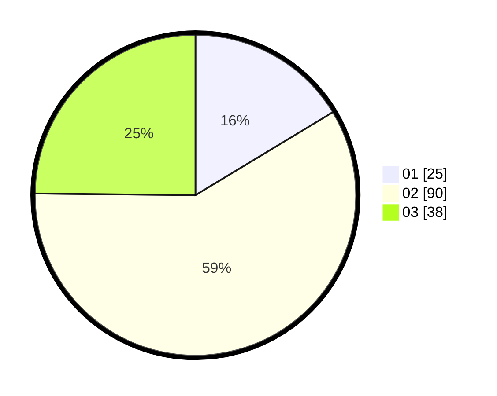

# Hasil

Hasil perolehan suara paslon dapat dilihat pada file paslon-01.txt, paslon-02.txt, dan paslon-03.txt.

Jika tidak ada, artinya data tersebut belum ada pada SIREKAP.

## Perolehan Suara

 * Paslon 01: **25**.
 * Paslon 02: **90**.
 * Paslon 03: **38**.

## Foto C Plano

https://sirekap-obj-formc.kpu.go.id/7178/pemilu/ppwp/31/73/01/10/05/3173011005380-20240215-041309--b20b4749-296a-40e3-b747-72df649d2422.jpg

https://sirekap-obj-formc.kpu.go.id/7178/pemilu/ppwp/31/73/01/10/05/3173011005380-20240215-041816--95eefbbf-9fd5-4995-9e6c-83140eb1a8e9.jpg

https://sirekap-obj-formc.kpu.go.id/7178/pemilu/ppwp/31/73/01/10/05/3173011005380-20240215-042008--f8c8ad37-96ec-4c6b-b5ba-220764fe1976.jpg

## DATA PEMILIH TETAP

Jumlah pemilih dalam DPT: **210**.
 * L: **107**.
 * P: **103**.

## DATA PENGGUNA HAK PILIH

Jumlah pengguna hak pilih dalam DPT: **148**.
 * L: **69**.
 * P: **79**.

Jumlah pengguna hak pilih dalam DPTb: **0**.
 * L: **0**.
 * P: **0**.

Jumlah pengguna hak pilih dalam DPK: **5**.
 * L: **2**.
 * P: **3**.

Jumlah pengguna hak pilih: **153**.
 * L: **71**.
 * P: **82**.

## JUMLAH SUARA SAH DAN TIDAK SAH

JUMLAH SELURUH SUARA SAH: **153**.

JUMLAH SUARA TIDAK SAH: **0**.

JUMLAH SELURUH SUARA SAH DAN SUARA TIDAK SAH: **153**.
