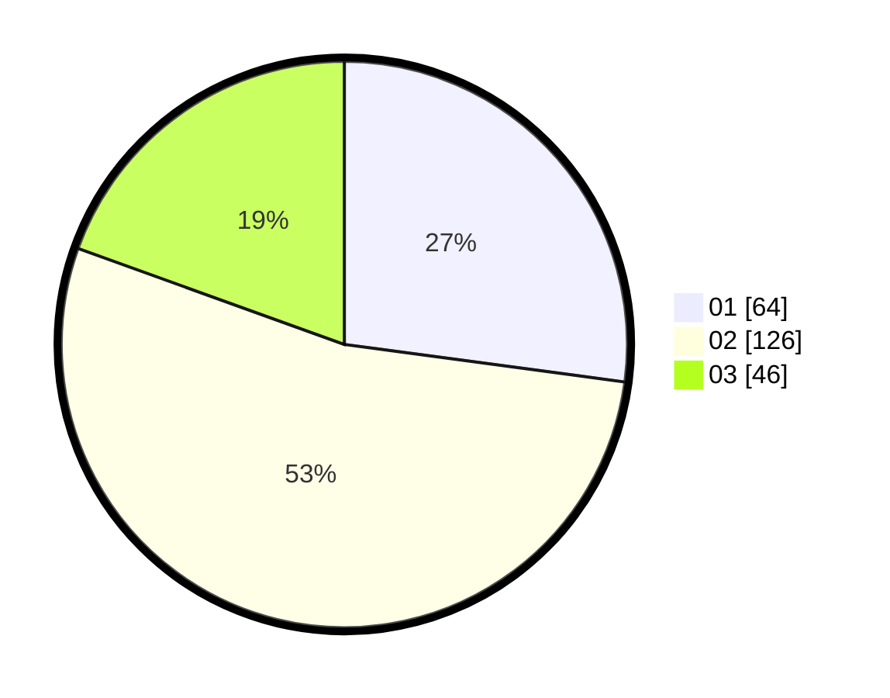

# Hasil

Hasil perolehan suara paslon dapat dilihat pada file paslon-01.txt, paslon-02.txt, dan paslon-03.txt.

Jika tidak ada, artinya data tersebut belum ada pada SIREKAP.

## Perolehan Suara

 * Paslon 01: **64**.
 * Paslon 02: **126**.
 * Paslon 03: **46**.

## Foto C Plano

https://sirekap-obj-formc.kpu.go.id/c147/pemilu/ppwp/31/73/01/10/05/3173011005386-20240214-155121--0d1582ca-ede3-4904-b0c8-934a8347d359.jpg

https://sirekap-obj-formc.kpu.go.id/c147/pemilu/ppwp/31/73/01/10/05/3173011005386-20240214-202136--64dc3d04-78ad-497f-afa9-39c5c5f5cb75.jpg

https://sirekap-obj-formc.kpu.go.id/c147/pemilu/ppwp/31/73/01/10/05/3173011005386-20240214-202320--010333f9-5c2e-436f-87b3-d30e22f8ed77.jpg
