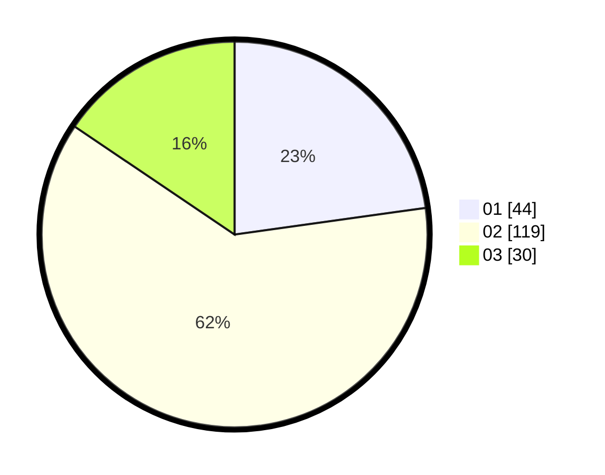

# Hasil

Hasil perolehan suara paslon dapat dilihat pada file paslon-01.txt, paslon-02.txt, dan paslon-03.txt.

Jika tidak ada, artinya data tersebut belum ada pada SIREKAP.

## Perolehan Suara

 * Paslon 01: **44**.
 * Paslon 02: **119**.
 * Paslon 03: **30**.

## Foto C Plano

https://sirekap-obj-formc.kpu.go.id/dfd3/pemilu/ppwp/31/73/01/10/05/3173011005393-20240215-023840--9b9dce7e-5682-4914-a892-58348655794a.jpg

https://sirekap-obj-formc.kpu.go.id/dfd3/pemilu/ppwp/31/73/01/10/05/3173011005393-20240215-023942--e96388ab-65e1-4e73-973c-c1296e3f51d7.jpg

https://sirekap-obj-formc.kpu.go.id/dfd3/pemilu/ppwp/31/73/01/10/05/3173011005393-20240215-024450--55e396b7-35e7-4f54-8a52-c77186177935.jpg
