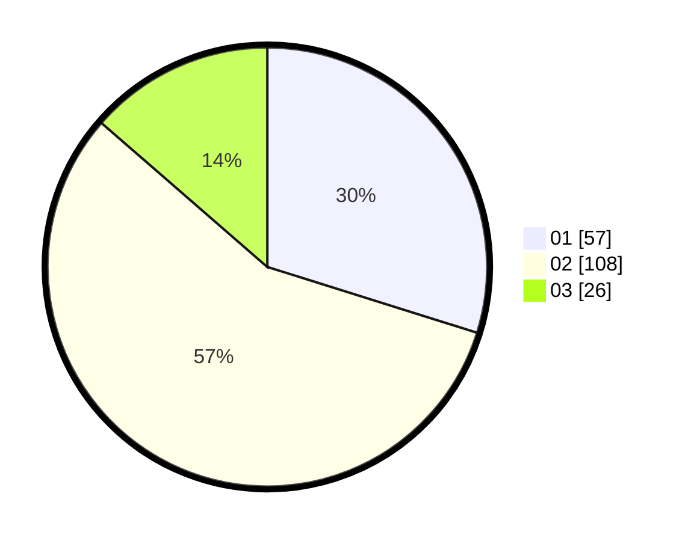

# Hasil

Hasil perolehan suara paslon dapat dilihat pada file paslon-01.txt, paslon-02.txt, dan paslon-03.txt.

Jika tidak ada, artinya data tersebut belum ada pada SIREKAP.

## Perolehan Suara

 * Paslon 01: **57**.
 * Paslon 02: **108**.
 * Paslon 03: **26**.

## Foto C Plano

https://sirekap-obj-formc.kpu.go.id/d5e0/pemilu/ppwp/31/73/01/10/05/3173011005395-20240214-204542--db70f7de-c582-4ecf-9170-dc12eb71a237.jpg

https://sirekap-obj-formc.kpu.go.id/d5e0/pemilu/ppwp/31/73/01/10/05/3173011005395-20240214-204801--d72a28e4-af6a-4226-8c24-462a67dc9eab.jpg

https://sirekap-obj-formc.kpu.go.id/d5e0/pemilu/ppwp/31/73/01/10/05/3173011005395-20240214-204925--8aa27902-b4bb-40d2-a2a9-d38e0ca1fbe6.jpg

## DATA PEMILIH TETAP

Jumlah pemilih dalam DPT: **282**.
 * L: **143**.
 * P: **139**.

## DATA PENGGUNA HAK PILIH

Jumlah pengguna hak pilih dalam DPT: **185**.
 * L: **87**.
 * P: **98**.

Jumlah pengguna hak pilih dalam DPTb: **1**.
 * L: **1**.
 * P: **0**.

Jumlah pengguna hak pilih dalam DPK: **5**.
 * L: **4**.
 * P: **1**.

Jumlah pengguna hak pilih: **191**.
 * L: **92**.
 * P: **99**.

## JUMLAH SUARA SAH DAN TIDAK SAH

JUMLAH SELURUH SUARA SAH: **191**.

JUMLAH SUARA TIDAK SAH: **0**.

JUMLAH SELURUH SUARA SAH DAN SUARA TIDAK SAH: **191**.
