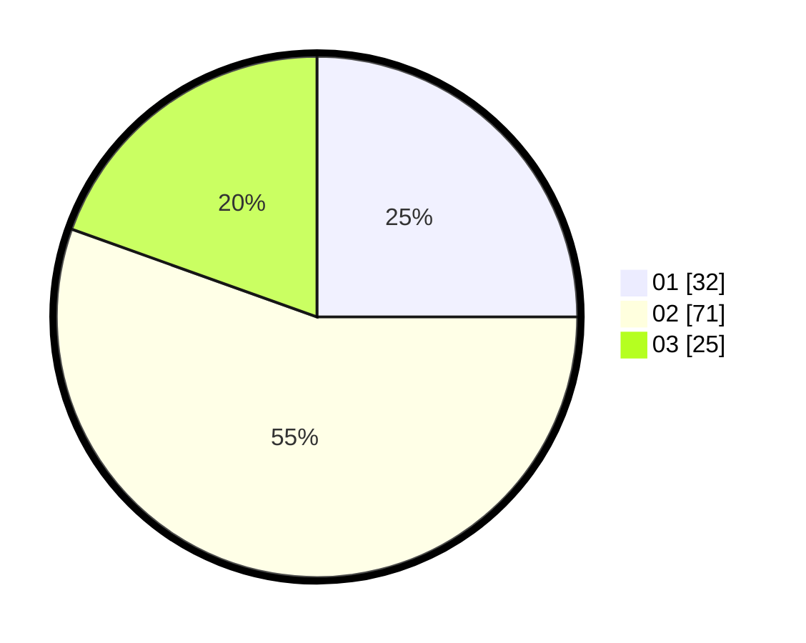

# Hasil

Hasil perolehan suara paslon dapat dilihat pada file paslon-01.txt, paslon-02.txt, dan paslon-03.txt.

Jika tidak ada, artinya data tersebut belum ada pada SIREKAP.

## Perolehan Suara

 * Paslon 01: **32**.
 * Paslon 02: **71**.
 * Paslon 03: **25**.

## Foto C Plano

https://sirekap-obj-formc.kpu.go.id/ae36/pemilu/ppwp/31/73/01/10/05/3173011005399-20240214-205700--6eb1c8d9-f811-4f3a-8d93-c71a298f4cb2.jpg

https://sirekap-obj-formc.kpu.go.id/ae36/pemilu/ppwp/31/73/01/10/05/3173011005399-20240214-204515--7f8ec8a9-00d2-46c9-9f80-5e8135063639.jpg

https://sirekap-obj-formc.kpu.go.id/ae36/pemilu/ppwp/31/73/01/10/05/3173011005399-20240214-204350--0847d359-5d32-48cb-b78f-795d0c2fc457.jpg

## DATA PEMILIH TETAP

Jumlah pemilih dalam DPT: **126**.
 * L: **61**.
 * P: **65**.

## DATA PENGGUNA HAK PILIH

Jumlah pengguna hak pilih dalam DPT: **126**.
 * L: **61**.
 * P: **65**.

Jumlah pengguna hak pilih dalam DPTb: **0**.
 * L: **0**.
 * P: **0**.

Jumlah pengguna hak pilih dalam DPK: **6**.
 * L: **3**.
 * P: **3**.

Jumlah pengguna hak pilih: **132**.
 * L: **64**.
 * P: **68**.

## JUMLAH SUARA SAH DAN TIDAK SAH

JUMLAH SELURUH SUARA SAH: **128**.

JUMLAH SUARA TIDAK SAH: **4**.

JUMLAH SELURUH SUARA SAH DAN SUARA TIDAK SAH: **132**.
