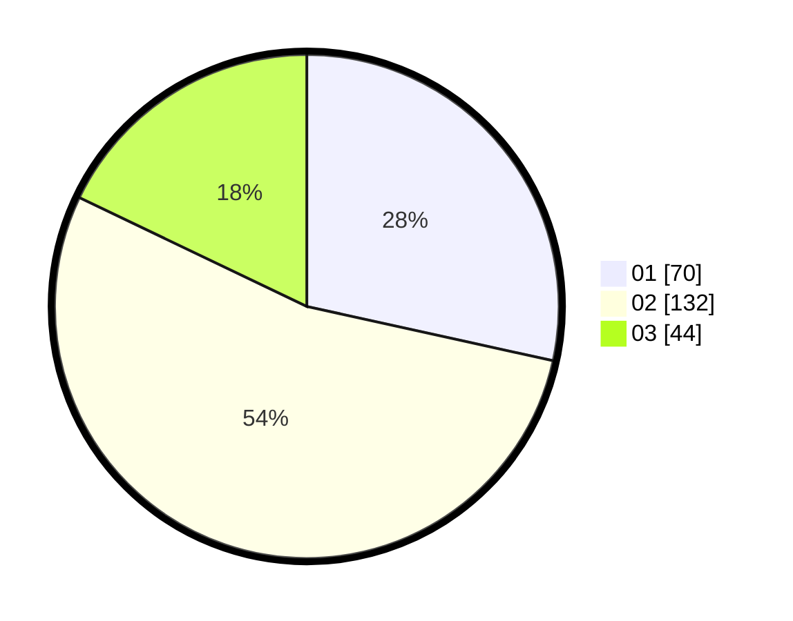

# Hasil

Hasil perolehan suara paslon dapat dilihat pada file paslon-01.txt, paslon-02.txt, dan paslon-03.txt.

Jika tidak ada, artinya data tersebut belum ada pada SIREKAP.

## Perolehan Suara

 * Paslon 01: **70**.
 * Paslon 02: **132**.
 * Paslon 03: **44**.

## Foto C Plano

https://sirekap-obj-formc.kpu.go.id/9772/pemilu/ppwp/31/73/01/10/05/3173011005400-20240215-003205--dfdefd79-f3a1-4529-818e-f3a749ede874.jpg

https://sirekap-obj-formc.kpu.go.id/9772/pemilu/ppwp/31/73/01/10/05/3173011005400-20240215-003604--7545a6e3-ea93-4938-89a8-e806c029d87f.jpg

https://sirekap-obj-formc.kpu.go.id/9772/pemilu/ppwp/31/73/01/10/05/3173011005400-20240215-004336--a7c6c25e-f62a-42a4-a50f-aea8e074a40e.jpg
