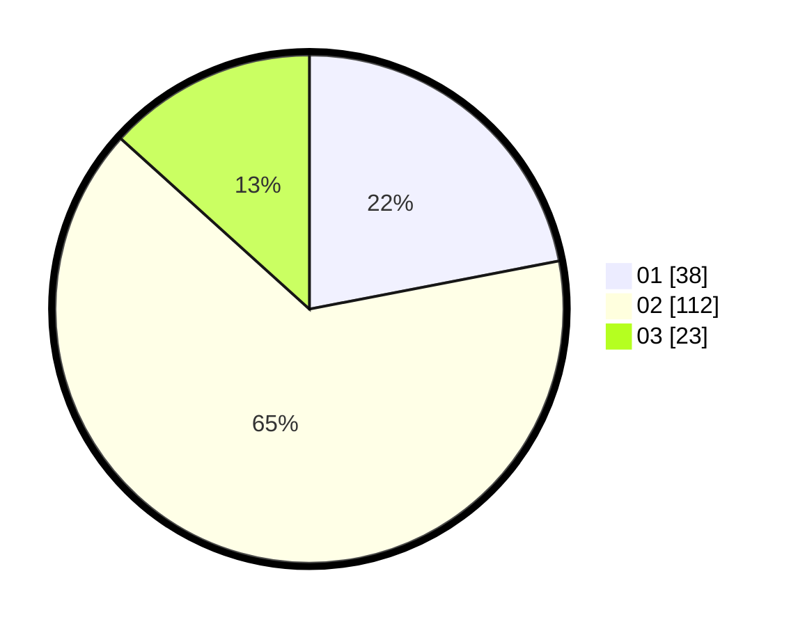

# Hasil

Hasil perolehan suara paslon dapat dilihat pada file paslon-01.txt, paslon-02.txt, dan paslon-03.txt.

Jika tidak ada, artinya data tersebut belum ada pada SIREKAP.

## Perolehan Suara

 * Paslon 01: **38**.
 * Paslon 02: **112**.
 * Paslon 03: **23**.

## Foto C Plano

https://sirekap-obj-formc.kpu.go.id/045b/pemilu/ppwp/31/73/01/10/05/3173011005402-20240214-192314--4181c474-84cd-4315-9024-2bd5bce9ec1d.jpg

https://sirekap-obj-formc.kpu.go.id/045b/pemilu/ppwp/31/73/01/10/05/3173011005402-20240214-191527--c89430a1-c9a4-4faf-a738-ee5c93d9b73f.jpg

https://sirekap-obj-formc.kpu.go.id/045b/pemilu/ppwp/31/73/01/10/05/3173011005402-20240214-191701--f3d39328-90f4-4854-a54f-a9a29f6502f0.jpg
