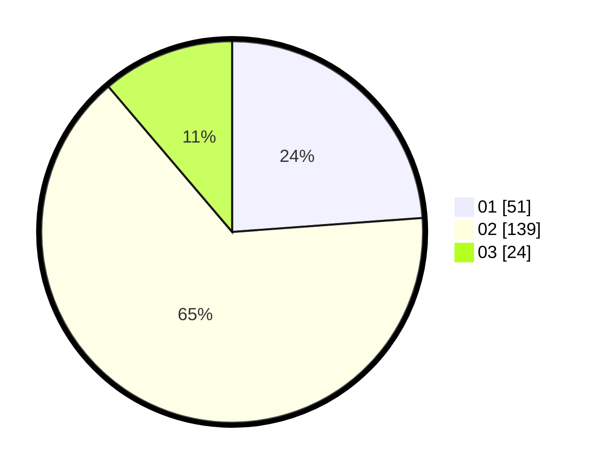

# Hasil

Hasil perolehan suara paslon dapat dilihat pada file paslon-01.txt, paslon-02.txt, dan paslon-03.txt.

Jika tidak ada, artinya data tersebut belum ada pada SIREKAP.

## Perolehan Suara

 * Paslon 01: **51**.
 * Paslon 02: **139**.
 * Paslon 03: **24**.

## Foto C Plano

https://sirekap-obj-formc.kpu.go.id/3512/pemilu/ppwp/31/73/01/10/05/3173011005405-20240216-005638--5b96bb2e-14d4-4bbc-9f07-0a44a6bd2d50.jpg

https://sirekap-obj-formc.kpu.go.id/3512/pemilu/ppwp/31/73/01/10/05/3173011005405-20240216-005640--d356b9af-2804-429a-86c8-b3902886cb38.jpg

https://sirekap-obj-formc.kpu.go.id/3512/pemilu/ppwp/31/73/01/10/05/3173011005405-20240216-005639--4bdebb8a-5085-46b5-8ebb-843673c2a24d.jpg

## DATA PEMILIH TETAP

Jumlah pemilih dalam DPT: **288**.
 * L: **140**.
 * P: **148**.

## DATA PENGGUNA HAK PILIH

Jumlah pengguna hak pilih dalam DPT: **203**.
 * L: **96**.
 * P: **107**.

Jumlah pengguna hak pilih dalam DPTb: **9**.
 * L: **5**.
 * P: **4**.

Jumlah pengguna hak pilih dalam DPK: **5**.
 * L: **2**.
 * P: **3**.

Jumlah pengguna hak pilih: **217**.
 * L: **103**.
 * P: **114**.

## JUMLAH SUARA SAH DAN TIDAK SAH

JUMLAH SELURUH SUARA SAH: **214**.

JUMLAH SUARA TIDAK SAH: **3**.

JUMLAH SELURUH SUARA SAH DAN SUARA TIDAK SAH: **217**.
