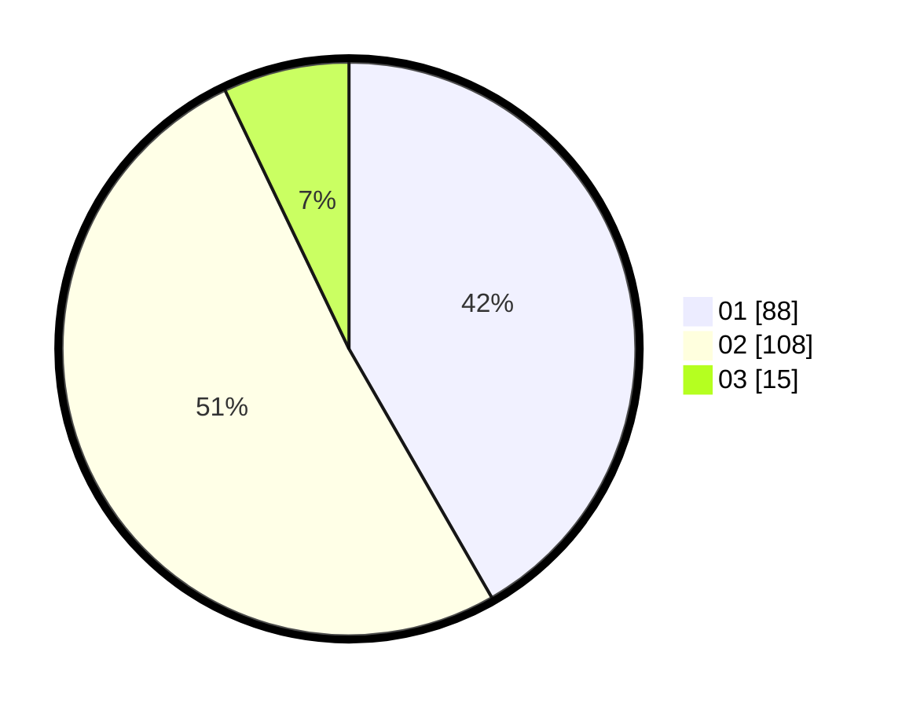

# Hasil

Hasil perolehan suara paslon dapat dilihat pada file paslon-01.txt, paslon-02.txt, dan paslon-03.txt.

Jika tidak ada, artinya data tersebut belum ada pada SIREKAP.

## Perolehan Suara

 * Paslon 01: **88**.
 * Paslon 02: **108**.
 * Paslon 03: **15**.

## Foto C Plano

https://sirekap-obj-formc.kpu.go.id/8e62/pemilu/ppwp/31/73/01/10/05/3173011005407-20240214-232922--69f87719-86c2-4f62-8738-390f64780e04.jpg

https://sirekap-obj-formc.kpu.go.id/8e62/pemilu/ppwp/31/73/01/10/05/3173011005407-20240214-233050--06d92ba0-6462-4c3a-9259-6803d2f13860.jpg

https://sirekap-obj-formc.kpu.go.id/8e62/pemilu/ppwp/31/73/01/10/05/3173011005407-20240214-234319--50a34eb8-18e2-408c-93e4-5472bb084d4c.jpg

## DATA PEMILIH TETAP

Jumlah pemilih dalam DPT: **267**.
 * L: **129**.
 * P: **138**.

## DATA PENGGUNA HAK PILIH

Jumlah pengguna hak pilih dalam DPT: **210**.
 * L: **99**.
 * P: **111**.

Jumlah pengguna hak pilih dalam DPTb: **0**.
 * L: **0**.
 * P: **0**.

Jumlah pengguna hak pilih dalam DPK: **4**.
 * L: **1**.
 * P: **3**.

Jumlah pengguna hak pilih: **214**.
 * L: **100**.
 * P: **114**.

## JUMLAH SUARA SAH DAN TIDAK SAH

JUMLAH SELURUH SUARA SAH: **211**.

JUMLAH SUARA TIDAK SAH: **3**.

JUMLAH SELURUH SUARA SAH DAN SUARA TIDAK SAH: **214**.
