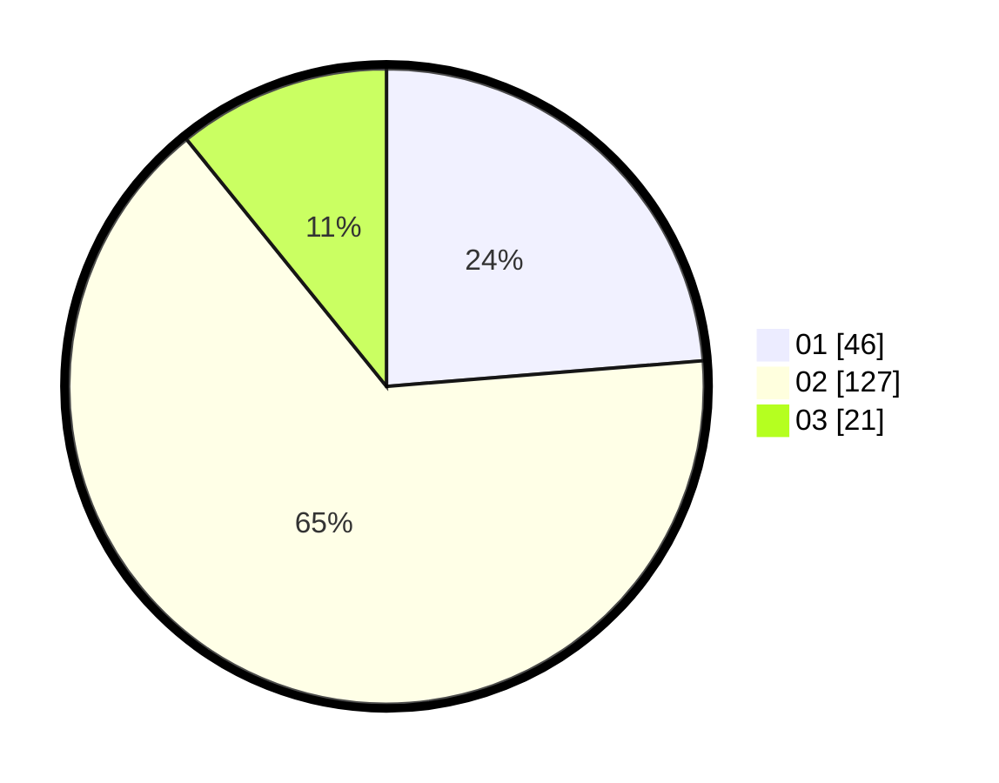

# Hasil

Hasil perolehan suara paslon dapat dilihat pada file paslon-01.txt, paslon-02.txt, dan paslon-03.txt.

Jika tidak ada, artinya data tersebut belum ada pada SIREKAP.

## Perolehan Suara

 * Paslon 01: **46**.
 * Paslon 02: **127**.
 * Paslon 03: **21**.

## Foto C Plano

https://sirekap-obj-formc.kpu.go.id/4f55/pemilu/ppwp/31/73/01/10/05/3173011005409-20240215-015228--a1370898-a10e-48df-a7c9-6fc069d00562.jpg

https://sirekap-obj-formc.kpu.go.id/4f55/pemilu/ppwp/31/73/01/10/05/3173011005409-20240215-014956--5b107a17-c20c-4bf5-b654-25e89eccf633.jpg

https://sirekap-obj-formc.kpu.go.id/4f55/pemilu/ppwp/31/73/01/10/05/3173011005409-20240215-015107--3fa0f623-ab78-4c37-81e9-d8a411fbeb63.jpg
