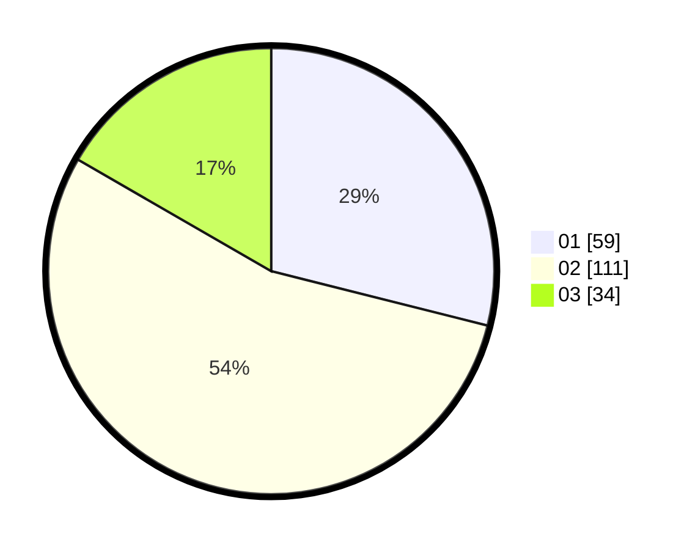

# Hasil

Hasil perolehan suara paslon dapat dilihat pada file paslon-01.txt, paslon-02.txt, dan paslon-03.txt.

Jika tidak ada, artinya data tersebut belum ada pada SIREKAP.

## Perolehan Suara

 * Paslon 01: **59**.
 * Paslon 02: **111**.
 * Paslon 03: **34**.

## Foto C Plano

https://sirekap-obj-formc.kpu.go.id/08a8/pemilu/ppwp/31/73/01/10/05/3173011005412-20240214-204324--71a88fe0-2f0a-4d90-b981-9c008116f7ee.jpg

https://sirekap-obj-formc.kpu.go.id/08a8/pemilu/ppwp/31/73/01/10/05/3173011005412-20240214-205539--ba85e063-4403-4707-9974-6149eed68881.jpg

https://sirekap-obj-formc.kpu.go.id/08a8/pemilu/ppwp/31/73/01/10/05/3173011005412-20240214-205720--e692f2c1-2c13-4d7f-95a9-640866e8f4a0.jpg

## DATA PEMILIH TETAP

Jumlah pemilih dalam DPT: **207**.
 * L: **94**.
 * P: **113**.

## DATA PENGGUNA HAK PILIH

Jumlah pengguna hak pilih dalam DPT: **281**.
 * L: **135**.
 * P: **146**.

Jumlah pengguna hak pilih dalam DPTb: **0**.
 * L: **0**.
 * P: **0**.

Jumlah pengguna hak pilih dalam DPK: **0**.
 * L: **0**.
 * P: **0**.

Jumlah pengguna hak pilih: **281**.
 * L: **135**.
 * P: **146**.

## JUMLAH SUARA SAH DAN TIDAK SAH

JUMLAH SELURUH SUARA SAH: **204**.

JUMLAH SUARA TIDAK SAH: **3**.

JUMLAH SELURUH SUARA SAH DAN SUARA TIDAK SAH: **207**.
