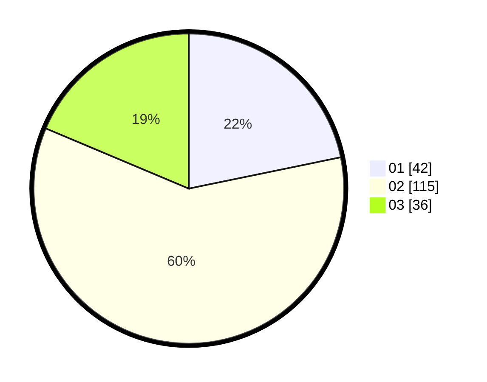

# Hasil

Hasil perolehan suara paslon dapat dilihat pada file paslon-01.txt, paslon-02.txt, dan paslon-03.txt.

Jika tidak ada, artinya data tersebut belum ada pada SIREKAP.

## Perolehan Suara

 * Paslon 01: **42**.
 * Paslon 02: **115**.
 * Paslon 03: **36**.

## Foto C Plano

https://sirekap-obj-formc.kpu.go.id/66c0/pemilu/ppwp/31/73/01/10/05/3173011005415-20240216-033405--cda997d1-902d-4a32-bd0b-6eec011e3074.jpg

https://sirekap-obj-formc.kpu.go.id/66c0/pemilu/ppwp/31/73/01/10/05/3173011005415-20240216-033406--b90bfe59-9048-4859-beb8-b196d8dfd0eb.jpg

https://sirekap-obj-formc.kpu.go.id/66c0/pemilu/ppwp/31/73/01/10/05/3173011005415-20240216-033405--4ab5c35c-7f87-4cf9-b52b-723e0f55c8df.jpg

## DATA PEMILIH TETAP

Jumlah pemilih dalam DPT: **256**.
 * L: **129**.
 * P: **127**.

## DATA PENGGUNA HAK PILIH

Jumlah pengguna hak pilih dalam DPT: **197**.
 * L: **96**.
 * P: **101**.

Jumlah pengguna hak pilih dalam DPTb: **0**.
 * L: **0**.
 * P: **0**.

Jumlah pengguna hak pilih dalam DPK: **0**.
 * L: **0**.
 * P: **0**.

Jumlah pengguna hak pilih: **197**.
 * L: **96**.
 * P: **101**.

## JUMLAH SUARA SAH DAN TIDAK SAH

JUMLAH SELURUH SUARA SAH: **193**.

JUMLAH SUARA TIDAK SAH: **4**.

JUMLAH SELURUH SUARA SAH DAN SUARA TIDAK SAH: **197**.
