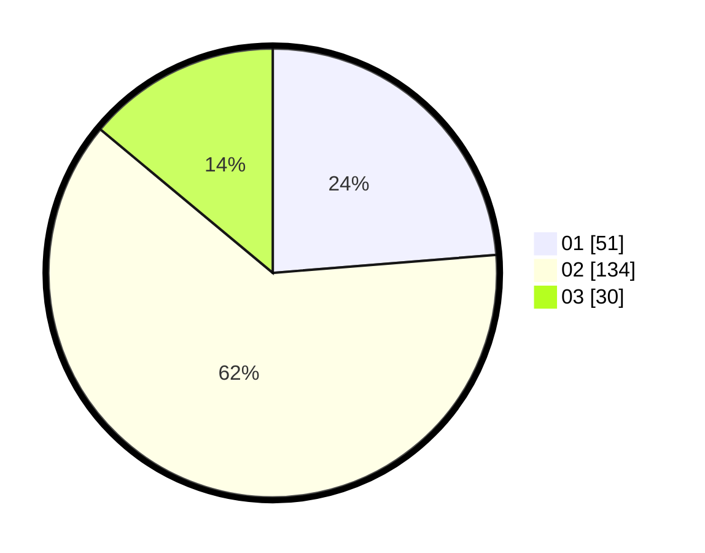

# Hasil

Hasil perolehan suara paslon dapat dilihat pada file paslon-01.txt, paslon-02.txt, dan paslon-03.txt.

Jika tidak ada, artinya data tersebut belum ada pada SIREKAP.

## Perolehan Suara

 * Paslon 01: **51**.
 * Paslon 02: **134**.
 * Paslon 03: **30**.

## Foto C Plano

https://sirekap-obj-formc.kpu.go.id/1de1/pemilu/ppwp/31/73/01/10/05/3173011005418-20240215-024418--e0c995df-c74a-4ae9-8cc5-261527cd5ffc.jpg

https://sirekap-obj-formc.kpu.go.id/1de1/pemilu/ppwp/31/73/01/10/05/3173011005418-20240215-023825--46d85baa-90ee-4971-a373-a00395680993.jpg

https://sirekap-obj-formc.kpu.go.id/1de1/pemilu/ppwp/31/73/01/10/05/3173011005418-20240215-024017--ecccee2d-3738-455b-8c58-7b486163f732.jpg
