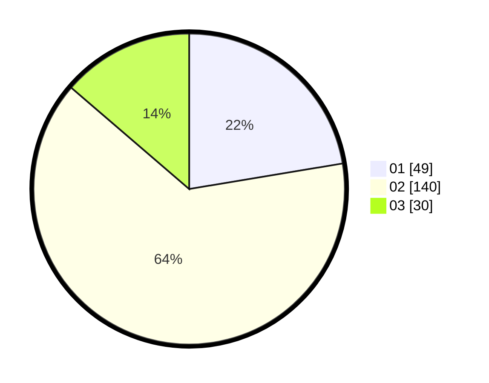

# Hasil

Hasil perolehan suara paslon dapat dilihat pada file paslon-01.txt, paslon-02.txt, dan paslon-03.txt.

Jika tidak ada, artinya data tersebut belum ada pada SIREKAP.

## Perolehan Suara

 * Paslon 01: **49**.
 * Paslon 02: **140**.
 * Paslon 03: **30**.

## Foto C Plano

https://sirekap-obj-formc.kpu.go.id/7080/pemilu/ppwp/31/73/01/10/05/3173011005429-20240215-110219--f6a98df9-b618-43f9-bab8-6a186ad0616d.jpg

https://sirekap-obj-formc.kpu.go.id/7080/pemilu/ppwp/31/73/01/10/05/3173011005429-20240215-110420--6fb2bbbe-7e78-44b5-87b7-aa4f4c0552d2.jpg

https://sirekap-obj-formc.kpu.go.id/7080/pemilu/ppwp/31/73/01/10/05/3173011005429-20240215-110522--d4bc1860-1195-412a-8be6-572fe84362df.jpg

## DATA PEMILIH TETAP

Jumlah pemilih dalam DPT: **284**.
 * L: **145**.
 * P: **139**.

## DATA PENGGUNA HAK PILIH

Jumlah pengguna hak pilih dalam DPT: **214**.
 * L: **105**.
 * P: **109**.

Jumlah pengguna hak pilih dalam DPTb: **5**.
 * L: **2**.
 * P: **3**.

Jumlah pengguna hak pilih dalam DPK: **0**.
 * L: **0**.
 * P: **0**.

Jumlah pengguna hak pilih: **219**.
 * L: **107**.
 * P: **112**.

## JUMLAH SUARA SAH DAN TIDAK SAH

JUMLAH SELURUH SUARA SAH: **220**.

JUMLAH SUARA TIDAK SAH: **2**.

JUMLAH SELURUH SUARA SAH DAN SUARA TIDAK SAH: **222**.
